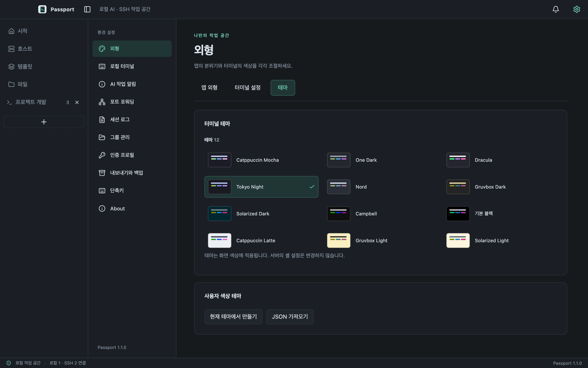

<p align="center">
  
</p>

<h1 align="center">Passport</h1>

<p align="center">
  <strong>서버를 한곳에, 작업은 원하는 방식으로.</strong><br />
  한국어 SSH 터미널과 파일 전송을 하나의 데스크톱 앱에서.
</p>

<p align="center">
  <a href="#설치">설치</a> ·
  <a href="#주요-기능">주요 기능</a> ·
  <a href="#시작하기">시작하기</a> ·
  <a href="docs/user-guide.md">사용 안내</a> ·
  <a href="docs/releases/README.md">릴리즈 노트</a>
</p>


<p align="center"><sub>실제 앱 화면이며 서버와 파일, 터미널 출력은 촬영용 예제 데이터입니다.</sub></p>

## 설치

[최신 공개 릴리즈](https://github.com/poyal/passport/releases/latest)에서 내 컴퓨터에 맞는 설치 파일을 받으세요. 버전별 변경 사항과 배포 상태는 [릴리즈 노트](docs/releases/README.md)에서 확인할 수 있습니다. 아래 기능 설명은 현재 소스를 기준으로 합니다.

| 내 컴퓨터                     | 설치 파일                                                                 | 제공 상태 |
| ----------------------------- | ------------------------------------------------------------------------- | --------- |
| Mac · Apple Silicon(M 시리즈) | [최신 릴리즈의 `.dmg`](https://github.com/poyal/passport/releases/latest) | 배포 중   |
| Windows · Intel / AMD(x64)    | `.exe` 설치 프로그램                                                      | 준비 중   |
| Windows · ARM64               | ARM64용 `.exe` 설치 프로그램                                              | 준비 중   |

Mac은 macOS 14 이상과 Apple Silicon(M 시리즈)을 대상으로 합니다. Rosetta는 필요하지 않으며 Intel Mac은 지원하지 않습니다.

### Mac에 설치하기

1. **DMG 설치 파일**을 다운로드하고 엽니다.
2. **Passport**를 **응용 프로그램(Applications)** 폴더로 옮깁니다.
3. Finder에서 Passport 설치 디스크를 추출합니다.
4. **응용 프로그램** 폴더에서 Passport를 실행합니다.

현재 Mac 설치본은 ad-hoc 서명이며 Apple의 Developer ID 서명·공증을 포함하지 않습니다. 공식 릴리즈에서 받은 앱의 실행이 차단되면 한 번 실행한 뒤 **시스템 설정 → 개인정보 보호 및 보안 → 그래도 열기**에서 허용하세요. [Apple의 앱 실행 안내](https://support.apple.com/ko-kr/102445).

저장한 비밀번호를 사용할 때 **Passport Safe Storage** 키체인 창이 나타나면 Mac의 **로그인 키체인 암호**를 입력하세요. 보통 Mac 로그인 암호와 같습니다. 신뢰하는 설치본에 **항상 허용**을 선택하면 반복 요청을 줄일 수 있습니다.

### 기존 버전에서 업데이트하기

1. **Passport 종료(⌘Q)**로 앱을 완전히 종료합니다.
2. 새 DMG의 Passport를 **응용 프로그램** 폴더로 복사하고 **대치**를 선택합니다.
3. 설치 디스크를 추출하고 응용 프로그램 폴더에서 새 버전을 실행합니다.

같은 Mac에서 앱을 대치하면 기존 호스트·인증·설정과 탭·분할 배치를 유지합니다. 서버 연결은 직접 다시 시작합니다. 별도 백업을 원하면 **설정 → 내보내기와 백업 → 내보내기**를 사용하세요. 업데이트 후 키체인 허용을 다시 요청할 수 있습니다.

앱 시작 시 GitHub Releases의 새 버전을 확인하며 **설정 → About → 업데이트 확인**에서도 확인할 수 있습니다. 새 버전이 있으면 **설치 파일 다운로드**로 브라우저에서 받아 위 순서로 설치하세요. 앱 내부 자동 설치·재시작은 제공하지 않습니다. 업데이트 확인 기능이 없는 이전 설치본도 새 DMG로 대치하면 됩니다.

### 다운로드 파일 확인하기

같은 릴리즈의 DMG와 `SHA256SUMS.txt`를 다운로드 폴더에 저장한 뒤 확인합니다.

```sh
cd ~/Downloads
shasum -a 256 -c SHA256SUMS.txt
```

설치 파일 이름 뒤에 `OK`가 표시되면 게시된 체크섬과 일치합니다.

## 주요 기능

| 기능                 | 할 수 있는 일                                                               |
| -------------------- | --------------------------------------------------------------------------- |
| **호스트 관리**      | 그룹·태그·즐겨찾기, 일괄 편집, 자동 OS 아이콘과 수동 아이콘 선택            |
| **구형 SSH 호환**    | CentOS 5/6 등 구형 서버의 키 교환을 자동 지원하고 현대 알고리즘을 우선 선택 |
| **탭과 분할 터미널** | SSH 연결을 탭으로 열고 드래그로 분할, 크기 조절, 별도 창으로 이동           |
| **스페이스**         | 현재 창의 터미널 탭과 분할 배치를 이름으로 저장하고 한 번에 다시 열기       |
| **양쪽 파일 탐색**   | 로컬·SFTP·FTP·명시적 FTPS 연결, 드래그와 우클릭 메뉴로 파일 전송            |
| **명령어 스니펫**    | 자주 쓰는 명령을 저장하고 선택한 터미널 또는 현재 탭 전체에 전달            |
| **테마와 글꼴**      | 기본 테마 12종, 사용자 테마, 글꼴·커서, 로그·주소·파일 종류별 색상          |
| **기록과 백업**      | 로컬 터미널, 포트 포워딩, 최대 30일 자동 로그 기록, 설정 내보내기·가져오기  |

### 호스트를 정리하고 빠르게 연결

이름·주소·계정·태그로 검색하고 그룹에 공통 설정을 지정하세요. 호스트를 두 번 클릭하면 연결됩니다. 아이콘을 선택하지 않으면 호스트 이름과 접속 후 OS 감지로 자동 표시하며, 직접 선택한 아이콘은 유지합니다.


### 서로 다른 서버도 같은 화면에서

파일 화면의 좌우 패널에 각각 컴퓨터나 서버를 선택하세요. 우클릭이나 **작업** 메뉴로 복사·이름 변경·새 폴더·권한 변경을 사용하고, 아래 전송 목록에서 결과를 확인할 수 있습니다.


### 오래 보는 터미널을 내 취향대로

앱의 라이트·다크 모드와 터미널 테마를 따로 선택하고 글꼴·커서·출력 강조를 조절하세요. **파일·폴더 색상 구분**은 색상이 없는 `ls -l`·`ll` 출력에서도 폴더·실행 파일·심볼릭 링크 이름을 테마에 맞춰 표시합니다. 서버가 보낸 ANSI 색상과 복사할 원문은 유지합니다.


설정 화면은 기능별 탭으로 구성하며 창 너비에 맞춰 카드와 입력란을 배치합니다. 기본·사용자 테마는 한 탭에서 관리하고 터미널 옵션은 ON/OFF 스위치로 조절합니다.



## 시작하기

1. **호스트 → 새 호스트**에서 서버 주소·포트·사용자 이름을 저장합니다.
2. 호스트를 두 번 클릭하고 비밀번호나 SSH 개인 키로 연결합니다. 첫 연결은 관리자가 제공한 SSH 지문과 비교한 뒤 승인합니다.
3. 탭을 다른 탭 위에 잠시 올린 뒤 터미널 가장자리로 드래그하면 분할됩니다. 분할 경계를 끌어 크기를 조절하세요.
4. **스페이스 → 현재 창 저장**에서 탭 순서·분할 방향과 크기·선택한 터미널을 이름으로 저장합니다. 저장한 이름을 누르면 기존 탭을 유지한 채 새 탭으로 열고 연결합니다. 폴더 버튼으로 배치만 열 수도 있습니다.
5. **파일**에서 좌우 연결을 선택하고 파일을 반대편으로 드래그하거나 작업 메뉴로 복사합니다.

명령어 저장, 터미널 검색, 세션 로그와 포트 포워딩은 [사용 안내](docs/user-guide.md)에서 확인하세요.

첫 지문 확인창은 **설정 → 인증 프로필 → SSH 호스트 키**에서 생략할 수 있습니다. 등록된 지문이 바뀌면 연결을 차단합니다. 지문 교체·신규 자산 선택 화면은 아직 제공하지 않습니다.

## 설정과 작업 배치 보관하기

**설정 → 내보내기와 백업**에서 호스트·그룹·스니펫·스페이스·작업 배치·설정을 파일로 내보내고 다른 컴퓨터에서 가져올 수 있습니다. 비밀번호와 개인 키는 기본적으로 제외하며, 포함할 때는 **10자 이상의 별도 암호**로 보호합니다. 암호는 파일에 저장하지 않으므로 따로 보관하세요. 가져올 파일을 선택하면 암호화된 파일에만 암호 입력창을 표시합니다.

열린 탭과 분할 배치는 자동 저장되며 앱을 다시 열면 복원합니다. 저장한 스페이스도 유지되며 서버 연결은 직접 다시 시작합니다.

## 문서와 개발

- [사용 안내](docs/user-guide.md): 연결·파일 전송·스페이스·설정·문제 해결.
- [릴리즈 노트](docs/releases/README.md): 버전별 변경 사항·날짜·배포 상태.
- [개발 안내](docs/development.md): 소스 실행·빌드·테스트.
- [검증 기록](docs/verification.md): 테스트 결과·성능 측정·검증 범위.
- [전체 문서](docs/README.md): 구조·배포·디자인 기록.
- [오픈소스 고지](THIRD_PARTY_NOTICES.md).

---

제작자 **Poyal** · [poyal.work@gmail.com](mailto:poyal.work@gmail.com) · [GitHub](https://github.com/poyal/passport) · [버그 신고·기능 제안](https://github.com/poyal/passport/issues)
