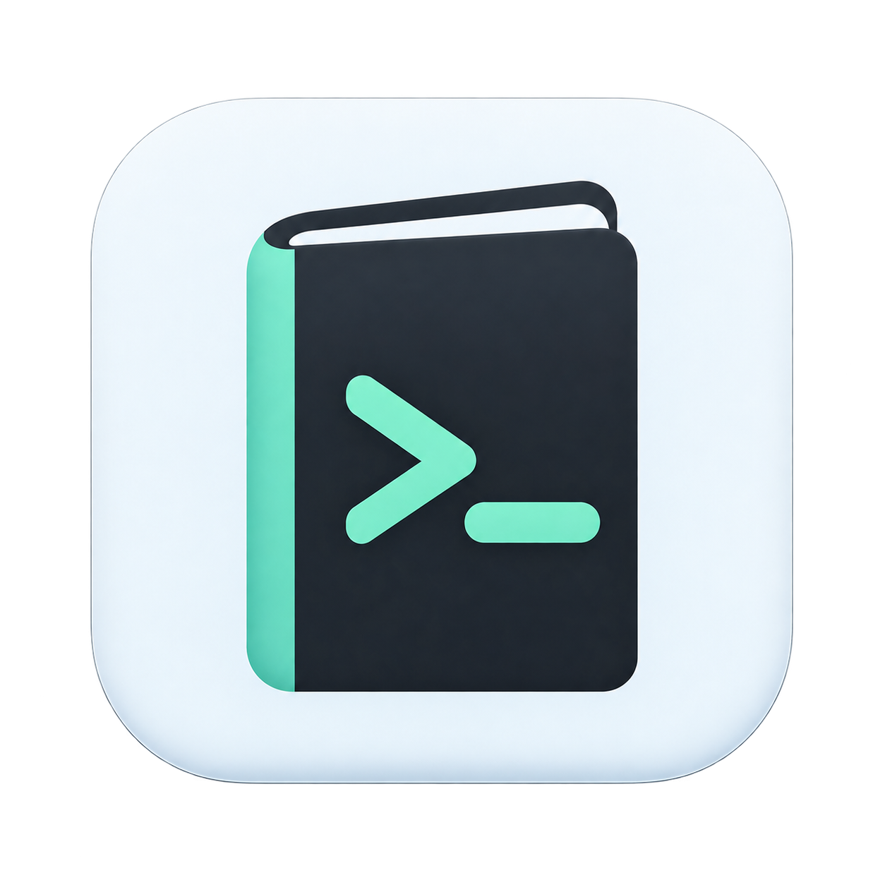
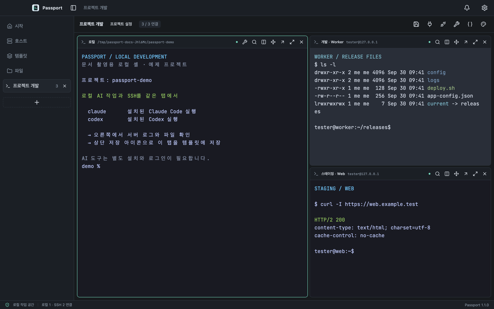
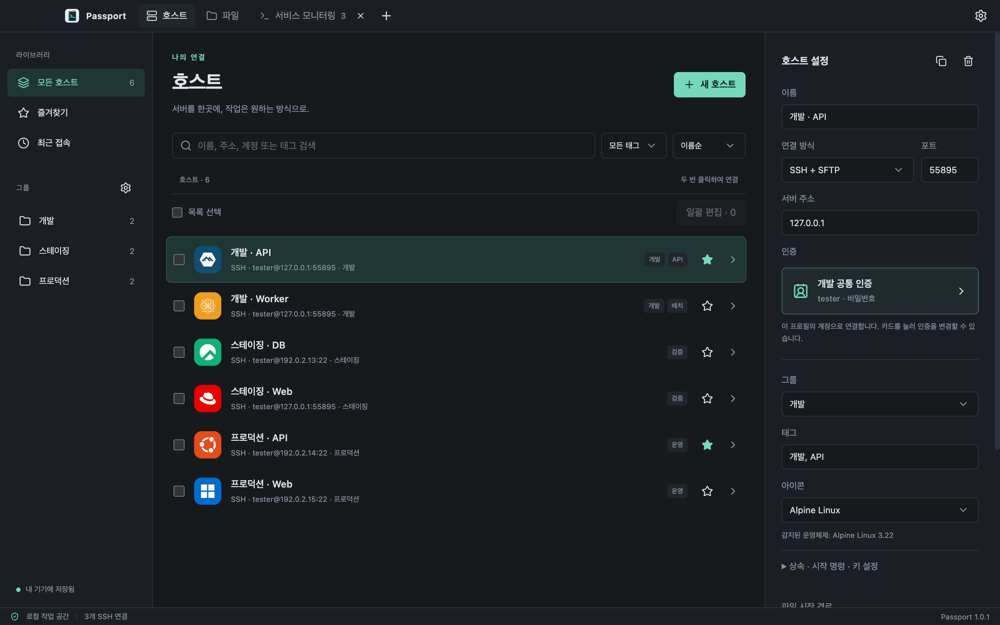
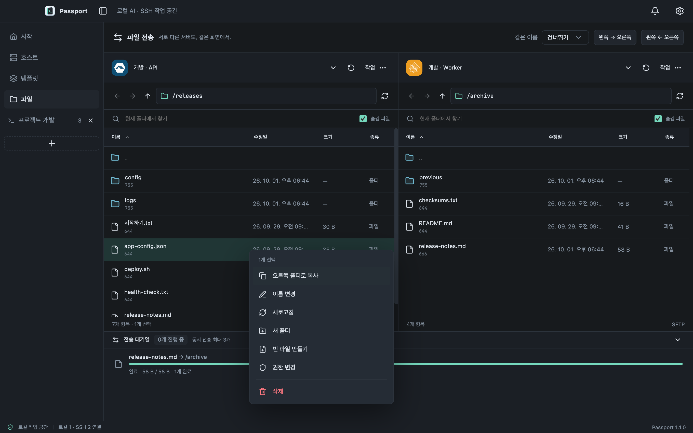
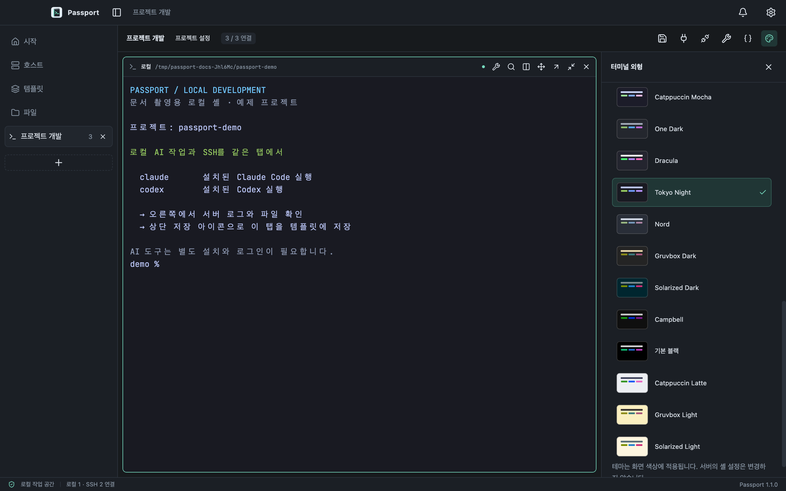

<p align="center">
  
</p>

<h1 align="center">Passport</h1>

<p align="center">
  <strong>내 컴퓨터의 AI 작업과 서버 터미널을 한 화면에서.</strong><br />
  로컬 터미널·Claude Code·Codex·SSH와 파일 전송을 하나의 데스크톱 앱에서.
</p>

<p align="center">
  <a href="https://github.com/poyal/passport/releases/latest">다운로드</a> ·
  <a href="#설치">설치</a> ·
  <a href="#주요-기능">주요 기능</a> ·
  <a href="#시작하기">시작하기</a> ·
  <a href="docs/user-guide.md">사용 안내</a>
</p>

로컬 AI 작업과 SSH 접속, 분할 터미널, 서버 간 파일 복사를 한 화면에서 처리합니다. 호스트를 그룹과 태그로 정리하고, 자주 사용하는 터미널 구성을 템플릿으로 저장해 다시 열 수 있습니다.



<p align="center"><sub>실제 앱 화면입니다. 서버·파일·터미널 출력은 촬영용 예제 데이터입니다.</sub></p>

## 설치

[최신 공개 릴리즈](https://github.com/poyal/passport/releases/latest)에서 컴퓨터에 맞는 설치 파일을 받으세요. 버전별 변경 사항은 [릴리즈 노트](docs/releases/README.md)에 정리합니다. 아래 기능 설명은 현재 소스 기준이며 로컬 AI·시작 프로파일·알림 기능은 다음 배포에 포함될 예정입니다.

| 컴퓨터                                       | 설치 파일                                                               | 배포 상태 |
| -------------------------------------------- | ----------------------------------------------------------------------- | --------- |
| Mac · Apple Silicon(M 시리즈), macOS 14 이상 | [Mac ARM64 `.dmg`](https://github.com/poyal/passport/releases/latest)   | 배포 중   |
| Windows 11 · Intel / AMD(x64)                | [Windows x64 `.exe`](https://github.com/poyal/passport/releases/latest) | 배포 중   |
| Windows · ARM64                              | ARM64용 설치 프로그램                                                   | 준비 중   |

### Windows

1. 릴리즈의 **Windows x64 EXE**를 다운로드해 실행합니다.
2. 설치 폴더를 선택하고 설치를 완료합니다.
3. 시작 메뉴에서 **Passport**를 실행합니다.

설치는 **현재 로그인한 사용자 전용**으로 고정되어 있습니다. 모든 사용자용 설치 선택 화면이나 관리자 권한 요청 없이 설치하며, 설치 폴더는 바꿀 수 있습니다. 저장한 비밀번호와 개인 키는 Windows 사용자 계정의 암호화 기능(DPAPI)으로 보호합니다.

현재 Windows EXE에는 코드 서명이 없습니다.

### Mac

1. 릴리즈의 **Mac ARM64 DMG**를 다운로드해 엽니다.
2. **Passport**를 **응용 프로그램(Applications)** 폴더로 옮깁니다.
3. Finder에서 설치 디스크를 추출하고 응용 프로그램 폴더의 Passport를 실행합니다.

Apple Silicon 전용이며 Rosetta가 필요하지 않습니다. Intel Mac은 지원하지 않습니다. 현재 Mac 설치본은 ad-hoc 서명이며 Developer ID 서명·Apple 공증을 포함하지 않습니다. 공식 릴리즈에서 받은 앱의 실행이 차단되면 한 번 실행한 뒤 **시스템 설정 → 개인정보 보호 및 보안 → 그래도 열기**에서 허용할 수 있습니다. [Apple의 앱 실행 안내](https://support.apple.com/ko-kr/102445).

저장한 비밀번호를 사용할 때 **Passport Safe Storage** 키체인 창이 나타나면 **로그인 키체인 암호**를 입력하세요. 보통 Mac 로그인 암호와 같습니다. 신뢰하는 설치본에 **항상 허용**을 선택하면 반복 요청을 줄일 수 있습니다.

### 업데이트

앱 시작 시 새 버전을 확인하며 **설정 → About → 업데이트 확인**에서도 확인할 수 있습니다. **설치 파일 다운로드**를 누르면 기본 브라우저에서 해당 플랫폼의 설치 파일을 받습니다.

- **Windows:** Passport를 종료하고 새 EXE 설치 프로그램을 실행합니다.
- **Mac:** **Passport 종료(⌘Q)** 후 새 DMG의 앱을 응용 프로그램 폴더에 복사하고 **대치**를 선택합니다.

호스트·설정과 작업 배치는 앱 설치 파일과 별도로 저장합니다. 업데이트 후 서버 연결은 직접 다시 시작하세요. 앱 내부 자동 설치·재시작은 제공하지 않습니다. 설정을 따로 보관하려면 **설정 → 내보내기와 백업**을 사용합니다.

### 다운로드 파일 확인

설치 파일과 같은 릴리즈의 **SHA256SUMS.txt**를 받으세요. 아래 명령으로 계산한 SHA-256이 체크섬 파일의 **해당 설치 파일 줄**과 같은지 비교합니다.

Windows PowerShell:

```powershell
cd ~/Downloads
Get-FileHash .\Passport-*-win-x64.exe -Algorithm SHA256
Get-Content .\SHA256SUMS.txt
```

Mac 터미널:

```sh
cd ~/Downloads
shasum -a 256 Passport-*-mac-arm64.dmg
cat SHA256SUMS.txt
```

## 주요 기능

| 기능                 | 할 수 있는 일                                                         |
| -------------------- | --------------------------------------------------------------------- |
| **호스트 관리**      | 그룹·태그·즐겨찾기, 검색·일괄 편집, 자동 OS 아이콘과 수동 아이콘 선택 |
| **SSH 접속**         | 비밀번호·개인 키 인증, 호스트 키 확인, 구형 서버의 키 교환 자동 호환  |
| **로컬 AI · SSH 작업** | 로컬·SSH 혼합 분할, Claude·Codex 실행, 프로젝트 폴더, 별도 창 이동 |
| **시작 프로파일** | Windows 내장 Passport Bash·cmd·PowerShell, macOS 셸, 여러 프로파일과 적용 순서 선택 |
| **AI 작업 알림** | 알림함·OS 알림·미확인 배지와 원래 터미널로 이동 |
| **템플릿**         | 탭 순서·분할 방향과 비율을 이름으로 저장하고 다시 열기                |
| **파일 전송**        | 로컬·SFTP·FTP·명시적 FTPS, 업로드·다운로드·서버 간 복사와 전송 취소   |
| **작업 도구**        | 명령어 스니펫, 터미널 검색, 로컬 터미널, 로컬·원격·SOCKS 포트 포워딩  |
| **외형 설정**        | 라이트·다크, 기본 테마 12종과 사용자 테마, 글꼴·커서·파일 종류별 색상 |
| **기록과 백업**      | 세션 로그, 최대 30일 자동 로그 보관, 설정 내보내기·가져오기           |

### 호스트를 정리하고 연결

이름·주소·계정·태그로 서버를 검색하고 그룹에 공통 설정을 지정하세요. 호스트를 두 번 클릭하면 연결됩니다. 아이콘을 지정하지 않으면 호스트 이름과 접속 후 감지한 OS로 표시하며 직접 선택한 아이콘은 유지합니다.



### 두 패널에서 파일 전송

파일 화면의 좌우 패널에 로컬 컴퓨터나 서버를 각각 선택합니다. 파일을 반대편으로 드래그하거나 **작업** 메뉴에서 복사하세요. 이름 변경·새 폴더·권한 변경도 같은 화면에서 처리하고 아래 전송 목록에서 진행 상태와 결과를 확인합니다.



### 터미널을 내 취향대로

앱의 라이트·다크 모드와 터미널 테마를 따로 선택하고 글꼴·커서·출력 강조를 조절합니다. **파일·폴더 색상 구분**을 켜면 색상이 없는 `ls -l`·`ll` 출력에서도 폴더·실행 파일·심볼릭 링크 이름을 구분합니다. 서버가 보낸 ANSI 색상과 복사할 원문은 유지합니다.



## 시작하기

1. 시작 화면에서 **로컬 터미널**을 선택하고 프로젝트 폴더와 셸을 골라 엽니다. 열린 터미널에서 `claude` 또는 `codex`를 실행합니다. SSH는 **호스트 → 새 호스트**에서 서버 정보를 저장합니다.
2. 호스트를 두 번 클릭하고 비밀번호나 SSH 개인 키로 연결합니다. 첫 연결은 서버 관리자가 제공한 SSH 지문과 비교해 승인합니다.
3. 탭을 다른 탭 위에 잠시 올린 뒤 터미널 가장자리로 드래그하면 분할됩니다. 분할 경계를 끌어 크기를 조절합니다.
4. **템플릿 → 현재 창 저장**에서 혼합 배치·프로젝트·셸·프로파일을 저장합니다. 이름은 배치만 불러오고 실행 버튼은 불러온 배치를 시작합니다.
5. **파일**에서 좌우 연결을 선택하고 파일을 복사합니다. 원격 서버 두 개를 선택하면 서버 간 전송도 가능합니다.

[로컬 AI·셸·프로파일·알림 사용법과 검증 범위](docs/local-ai-workspaces.md)를 확인하세요. 명령어 스니펫·터미널 검색·세션 로그·포트 포워딩의 자세한 사용법은 [사용 안내](docs/user-guide.md)를 확인하세요. 저장한 SSH 지문이 바뀌면 연결을 차단합니다.

## 설정과 작업 배치 보관

열린 탭과 분할 배치는 자동 저장되며 앱을 다시 열면 복원합니다. 저장한 템플릿도 유지됩니다. 앱 재시작 때 서버에 자동으로 연결하지 않으므로 필요한 연결을 직접 시작하세요.

**설정 → 내보내기와 백업**에서 호스트·그룹·스니펫·템플릿·작업 배치·설정을 파일로 내보내고 다른 컴퓨터에서 가져올 수 있습니다. 비밀번호와 개인 키는 기본적으로 제외하며 포함할 때는 **10자 이상의 별도 암호**로 보호합니다. 암호는 파일에 저장하지 않으므로 따로 보관하세요. 암호화된 파일을 가져올 때만 암호 입력창을 표시합니다.

## 문서와 개발

- [사용 안내](docs/user-guide.md): 연결·파일 전송·설정·문제 해결.
- [릴리즈 노트](docs/releases/README.md): 버전별 변경 사항과 배포 상태.
- [개발 안내](docs/development.md): 소스 실행·빌드·테스트.
- [검증 기록](docs/verification.md): Windows·Mac 테스트 결과와 성능 측정 범위.
- [배포 안내](docs/distribution.md): 패키징과 GitHub Release 게시.
- [전체 문서](docs/README.md) · [오픈소스 고지](THIRD_PARTY_NOTICES.md).

---

제작자 **Poyal** · [poyal.work@gmail.com](mailto:poyal.work@gmail.com) · [GitHub](https://github.com/poyal/passport) · [버그 신고·기능 제안](https://github.com/poyal/passport/issues)
