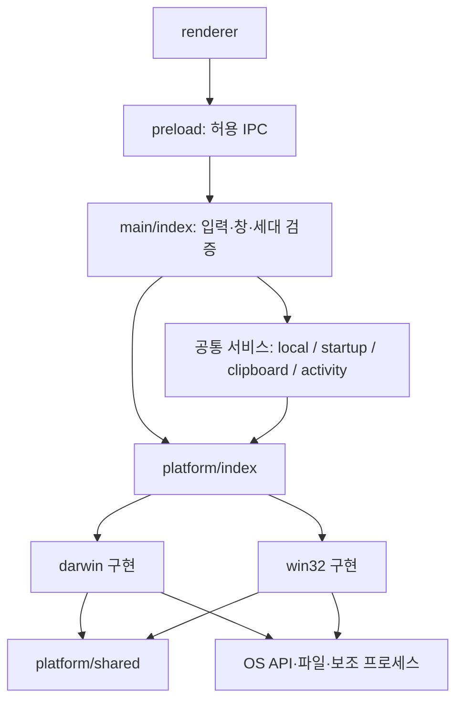

# Windows·macOS 개발 규칙

[문서 목록](README.md) · [환경 준비](development.md) · [전체 구현 구조](architecture.md) · [검증 기록](verification.md)

이 문서는 `src/main/platform/`과 그 호출부를 변경할 때 따르는 개발 기준이다. **필수**는 리뷰와 검증에서 확인해야 하는 조건, **금지**는 기존 설계를 우회하는 변경, **예외**는 아래에 명시한 기존 경계다. 코드와 이 문서가 어긋나면 실제 동작을 확인하고 같은 변경에서 둘 다 수정한다. 과거 검증 기록을 현재 소스의 검증으로 대신하지 않는다.

## 1. 분리 결정과 지원 범위

Passport는 저장소·앱·버전·`package-lock.json`을 하나로 유지한다. UI, SSH/SFTP/FTP, DB, IPC, 세션 수명은 공통으로 관리하고 **OS API·경로·셸 탐색·PTY 보정만 운영체제별 구현으로 분리**한다. Windows 수정이 Mac 코드를 건드리지 않고도 검토될 수 있고, 두 OS의 공통 기능은 한 번만 구현하는 구조다.

플랫폼별 저장소·브랜치·npm 패키지·별도 업데이트 피드를 만들지 않는다. 설치 파일은 기존처럼 OS와 아키텍처별로 생성한다. 계약을 바꾸려면 같은 변경에서 두 구현과 호출부·시험·문서를 수정한다. 한 플랫폼을 빈 구현으로 통과시키지 않는다.

| 대상 | 코드·빌드 구성 | 이번 분리의 검증 기준 |
| --- | --- | --- |
| macOS ARM64 | `darwin/`, Apple Silicon helper, Mac 패키지 | 타입·단위/통합, 소스/패키지 GUI, PTY 종료, 서명 무결성 |
| Windows 11 x64 | `win32/`, MSVC helper, 내장 Bash·ConPTY, NSIS | 같은 소스로 실제 Windows에서 셸·종료·파일 붙여넣기·아이콘 확인 |
| Windows ARM64 | 기존 대상·CI 구성 유지 | 별도 실기·패키지 검증 전 지원 확대나 배포 완료로 표시하지 않음 |
| Linux·Intel Mac | 앱 빌드 대상 아님 | Linux SSH 서버 지원과 데스크톱 앱 지원을 혼동하지 않음 |

`selectPlatform()`은 `darwin`·`win32`만 받는다. 알 수 없는 OS는 오류를 내며 Mac 구현으로 자동 대체하지 않는다. Mac에서 Windows 어댑터를 주입해 통과한 단위 검사는 Windows 네이티브 검증이 아니다. 실제 수행 결과와 남은 항목은 [검증 기록](verification.md)을 기준으로 한다.

## 2. 실제 파일 구조와 책임

```text
src/main/
  platform/
    contracts.ts                 # 타입 전용 계약
    index.ts                     # 유일한 OS 선택 지점
    shared/terminal.ts           # 셸 설명, OSC 표식, 기본 PTY 동작
    shared/clipboard.ts          # Blob·경로 검증, URL 해석, 제한된 외부 명령
    darwin/
      terminal.ts                # 로그인 셸, POSIX 경로, 종료 신호
      clipboard.ts               # AppKit/JXA, plist
      desktop.ts                 # Mac 창·앱 수명·알림 설정
      activity-endpoint.ts       # Unix socket 디렉터리·권한·정리
    win32/
      terminal.ts                # PE, 셸 후보, MSYS, ConPTY 입력 보정
      clipboard.ts               # CF_HDROP, 탐색기 파일 목록
      desktop.ts                 # AppUserModelID·ICO·표시 순서
      activity-endpoint.ts       # 고유 named pipe 주소
  shells.ts                      # 리소스 위치, 기존 셸 조회 API
  startup.ts                     # 프로파일 검증, 셸 문법·로더, LaunchSpec
  local.ts                       # PTY 소유권·세대·버퍼·ACK·종료 대기
  clipboard-files.ts             # 기존 codec/readClipboardFiles 진입점
  terminal-clipboard.ts          # 파일/이미지/텍스트 우선순위·저장·재검사
  activity.ts                    # 서버·토큰·메시지·DB·클라이언트 수명
  test-window.ts                 # 숨김/비활성 표시 정책
  index.ts                       # IPC 검증과 서비스 연결
```



### import 규칙

- **필수:** 공통 서비스는 `./platform`의 `platform` 또는 `selectPlatform()`과 `platform/contracts` 타입에 의존한다. OS 구현을 직접 선택하지 않는다.
- **금지:** renderer·preload·`src/shared`에서 `src/main/platform`을 가져오기, OS 구현에서 renderer·메인 진입점·DB·IPC를 가져오기, `darwin/`과 `win32/` 사이의 교차 import.
- **필수:** `contracts.ts`는 타입 import만 사용한다. OS 구현 모듈을 import하거나 팩터리를 만들 때 셸 실행·소켓 생성·클립보드 조회·Electron 앱 초기화를 하지 않는다. 실제 서비스 호출까지 늦춘다.
- **필수:** 세션별 변경 상태는 `createPtyBehavior()`의 새 객체에 둔다. 선택된 플랫폼 객체의 전역 상태로 프롬프트·타이머·세대 정보를 공유하지 않는다.
- **예외:** `startup.ts`의 OSC 표식 재노출과 `clipboard-files.ts`의 codec 재노출은 기존 호출·시험 호환을 위한 `platform/shared` 접근이다. OS 전용 codec·이름 있는 pasteboard 진입점은 selector를 통해 재노출한다. 새 제품 코드는 이 경로로 OS 선택을 우회하지 않는다.
- **예외:** `tests/platform.test.ts`는 두 구현의 팩터리를 직접 가져와 의존성을 주입한다. 테스트에서 `process.platform`을 바꿔 네이티브 모듈을 속이지 않는다.

### 어디에 변경할 것인가

| 변경 내용 | 수정 위치 | 이유 |
| --- | --- | --- |
| Windows 셸 발견·PE 아키텍처·MSYSTEM·ConPTY | `platform/win32/terminal.ts` | Windows 실행 방식 |
| Mac 로그인 셸·POSIX 종료 신호 | `platform/darwin/terminal.ts` | Mac 실행 방식 |
| Bash/Zsh/PowerShell/cmd 시작 문법·따옴표·프로파일 | `startup.ts`, `src/shared/paste.ts` | OS 이름보다 실행 셸 문법이 기준 |
| 출력 큐·ACK·재연결·종료 콜백 추적 | `local.ts` | 모든 플랫폼의 세션 불변조건 |
| Finder/탐색기 원본 형식 읽기 | 해당 OS의 `clipboard.ts` | OS 데이터 형식·API |
| 붙여넣기 대상 검증·이미지 저장·SSH 제한 | `terminal-clipboard.ts`, 메인 IPC | 제품 정책·권한 |
| 창 아이콘·앱 ID·알림 설정 목적지 | 해당 OS의 `desktop.ts` | 네이티브 데스크톱 동작 |
| 숨김·비활성 테스트 표시 | `test-window.ts`, E2E 실행 도구 | 공통 테스트 격리 |
| 알림 endpoint 주소·파일 권한 | 해당 OS의 `activity-endpoint.ts` | IPC 전송 기반 |
| 알림 토큰·소유권·DB·소켓 연결 | `activity.ts` | 공통 프로토콜·수명 |
| SSH·파일 전송·UI·DB·업데이트 선택 | 기존 공통 서비스 | OS 구현을 복제하지 않음 |
| Rust IPC·네이티브 패치·패키징 | `native/helper`, `scripts`, 빌드 설정 | TS 런타임 경계와 별개인 기존 빌드 책임 |

모든 `process.platform`을 기계적으로 옮기는 작업은 하지 않는다. 기존 DB 이행, 업데이트 자산 선택, bootstrap의 플랫폼 값, 단축키 표시, 폰트와 파일 경로 검증, 터미널 URL 길이 제한 같은 작은 데이터 정책은 공통에 남긴다. 기존 전송 코드의 파일 복사 플래그도 이번 범위 밖이다. 새로운 **OS 작업**을 공통 파일에 추가하려면 먼저 이 계약으로 표현할 수 있는지 검토한다.

### 단축키 데이터와 네이티브 메뉴

`src/shared/shortcuts.ts`는 공통 기능 목록·키 정규화·영역별 충돌 검사를 소유하고 `darwin`·`win32`별 기본값과 저장값만 분리한다. renderer와 shared에서 main 플랫폼 구현을 가져오지 않는다. 설정은 현재 OS만 편집하며, 두 OS 값을 함께 저장·이전·내보낸다. 빈 키 배열은 해제이므로 기본값으로 덮지 않는다.

`window.keyboardContext` IPC는 현재 창의 `standard`·`editing`·`terminal`·`files`·`dialog`·`recording`만 받는다. 공통 메인 호출부는 `before-input-event`에서 해당 영역이 소유한 키의 네이티브 메뉴 처리를 차단해 renderer로 전달한다. 일반 입력칸과 관련 없는 메뉴 키는 기존 동작을 유지한다. 키 등록 중에는 메뉴 단축키 실행을 막고, 창 종료·탐색 시 문맥을 버린다. 실제 OS 키 선점·IME는 주입 검사와 구분한다.

## 3. 계약 명세

기준 타입은 [contracts.ts](../src/main/platform/contracts.ts)다. 아래에서 별도 표시가 없으면 동기 호출이다. 계약은 실행 실패를 성공 값으로 감추지 않는다. 공통 호출부가 사용자 오류·정리·재시도 여부를 결정한다.

### 선택과 의존성 주입

`platform`은 실제 `process.platform`을 한 번 선택한 `PlatformServices`다. `selectPlatform(id)`는 지원하는 ID의 같은 서비스 객체를 반환하고, 미지원 ID는 throw한다. 서비스 생성과 실제 OS 사용은 구분된다.

`createDarwinTerminal({ arch, env, exists, loginShell })`, `createWindowsTerminal({ arch, env, exists, architecture })`는 선택적으로 조회 의존성을 받는다. 제품에서는 기본 OS 구현을 사용하고 단위 검사에서는 명시적인 Windows 경로와 가짜 조회를 넣는다. `createDarwinClipboard(run)`은 plist 명령을, `createWindowsClipboard(run, env)`는 탐색기 조회 명령과 Windows 루트를 주입한다. Mac의 실제 AppKit 조회는 이름 있는 pasteboard로 별도 통합 검사한다. `DesktopPlatform`에는 필요한 Electron 객체의 최소 메서드만 전달한다. Unix endpoint 팩터리의 선택적 `root`는 검사 소유 임시 디렉터리용이다.

### TerminalPlatform

| 멤버 | 입력 → 출력·부작용 | 실패·호출 규칙 |
| --- | --- | --- |
| `id`, `paths`, `helperName`, `useConptyDll` | OS ID, `path.posix`/`path.win32`, helper 파일명, ConPTY 사용 여부 | 경로는 검사 실행 OS가 아니라 대상 OS의 문법 사용 |
| `shells(resourceRoot)` | terminal 리소스 루트 → `ShellInfo[]`; 설치 여부·아키텍처 조회 | 미설치 후보는 `available: false`와 이유 반환. 임의 대체 실행 금지 |
| `executableArchitecture(file)` | 실행 파일 → 아키텍처 문자열 | Windows의 없는/잘못된 PE는 `unknown`; Mac은 현재 대상 아키텍처 |
| `defaultArgs(executable)` | 실행 파일 → `string[]` | `LaunchSpec.args`가 없을 때만 사용; cmd 빈 배열, Windows 나머지 `-NoLogo`, Mac `-l` |
| `posixPath(file)` | 대상 경로 → Bash용 경로 | Windows 드라이브와 역슬래시 변환; 셸 인용은 호출부 책임 |
| `profileKey(name)` | 이름 → 충돌 비교 키 | Windows 소문자, Mac 원문. 사용자 표시값을 수정하지 않음 |
| `configureEnvironment(env, snapshot, resourceRoot)` | **새 세션의 env 객체만 변경** | 런치마다 한 번. 기존 CLI Bash 경로 우선, Passport Bash에만 MSYS·OSC 표식 설정. `process.env` 직접 변경 금지 |
| `createPtyBehavior(snapshot?)` | 셸·세대 ID → 새 `PtyBehavior` | 세션당 한 객체, 다른 세션과 재사용 금지 |

Mac 로그인 셸은 최초 조회 때 계정 정보 → `dscl` → `SHELL` → `/bin/zsh`로 정하고 팩터리 인스턴스에 캐시한다. `dscl`은 1초 제한이다. Windows `default`·`powershell`은 설치된 PowerShell 7 또는 Windows PowerShell 5.1을 가리키는 기존 별칭이며 삭제하지 않는다.

### PtyBehavior의 순서와 수명

1. PTY를 연 뒤 `createPtyBehavior(launch?.snapshot)`를 세션에 보관한다.
2. 현재 세션인지 확인한 출력마다 `observeOutput(data)`를 **큐에 넣기 전에** 호출한다. 원문을 삭제하거나 renderer로 별도 전송하지 않는다.
3. 실제 크기 변경이 끝나면 `resized()`를 호출한다. 같은 크기 요청에는 호출하지 않는다.
4. 사용자 입력은 `input(data)`의 반환값을 PTY에 쓴다. 이 메서드는 동기 변환이며 직접 PTY에 쓰지 않는다.
5. 닫을 때 공통 코드가 읽기를 재개한 다음 `terminate(pty, alive)`를 호출한다. 이 메서드의 반환은 **종료 완료가 아니다**.
6. 실제 `onExit`에서 `dispose()`로 타이머를 해제한다. 공통 코드가 네이티브 콜백 스택 밖에서 종료 Promise를 완료한다.

Windows 보정은 `passport-bash`의 현재 세대 OSC 133 프롬프트를 확인한 경우에만 resize 뒤 첫 유효 입력에 NUL을 한 번 붙인다. Enter/명령 표식 뒤와 자식 TUI에는 주입하지 않으며 포커스 보고 시퀀스는 입력 보정을 소비하지 않는다. 청크 중간에서 잘린 표식도 인식한다. 다른 셸은 그대로 전달한다.

Mac은 일반 `kill()` 뒤 아직 살아 있으면 1초 후 `SIGKILL`을 보낸다. Windows에는 POSIX 시그널을 보내지 않는다. 종료 호출의 실패는 호출부로 전파하며, adapter가 DB를 닫거나 앱 종료 완료를 선언하지 않는다.

### ClipboardPlatform

| 메서드 | 입력 → 비동기 반환 | 규칙 |
| --- | --- | --- |
| `readFiles(items)` | Electron 형식의 `ClipboardEntry[]` → 파일 경로 배열 또는 `undefined` | 파일 형식이 없으면 `undefined`; 손상·과대 데이터·조회 실패는 reject. 파일 형식이 있지만 목록이 비어 있으면 빈 배열 가능 |
| `readNativeFiles?(pasteboardName?)` | Mac pasteboard 이름 또는 생략 → 파일 경로 배열 | 제품은 이름 생략, 시험은 고유 이름 사용. Windows는 메서드 없음. 조회 실패와 빈 결과를 구분 |

`ClipboardEntry.getType(type)`은 `Promise<unknown>`이며 사용 전에 Blob·크기를 확인한다. 파일 목록은 최대 1,000개, 경로당 32,768자, 목록 데이터는 4MiB로 제한하고 절대경로·제어 문자를 검사한다. Windows는 Unicode CF_HDROP을 우선하며 FileNameW 등만 있으면 고정 PowerShell 코드로 전체 목록을 읽는다. FileNameW가 있으면 읽기 전후 첫 경로도 비교한다. Mac은 AppKit 파일 URL을 읽고 changeCount를 검사하며, plist와 표준 file URL도 처리한다. 한글 경로를 임의로 정규화하지 않는다.

외부 명령은 `execFile`로 고정 실행 파일·인자를 사용한다. 데이터는 stdin 또는 argv 값으로 전달하며 셸 코드에 경로를 이어 붙이지 않는다. `clipboardCommand`의 **3초 timeout·4MiB maxBuffer·windowsHide**를 유지한다. 일반 웹 URL 목록은 파일로 취급하지 않고 텍스트 처리로 넘긴다.

`terminal-clipboard.ts`가 파일 → 이미지 → 텍스트의 우선순위를 결정한다. 메인 IPC가 제공한 `check()`로 읽기 전·비동기 읽기 후·저장 전후에 소유 창·연결 상태·세션 인스턴스를 재확인한다. renderer의 `PasteQueue`는 읽은 결과를 순서대로 전달하기 전에 대상 유효성을 다시 확인한다. OS adapter에 이 검사를 옮기거나 제거하지 않는다. 이미지 저장과 셸별 인용, SSH 파일 업로드 안내도 공통 책임이다.

### DesktopPlatform

| 멤버 | 시점·결과 | 필수 조건 |
| --- | --- | --- |
| `initialize(app, mode)` | 앱 초기화 때 한 번, 창 생성 전 | Windows 앱 ID 설정. Mac hidden/passive만 accessory 정책 |
| `windowOptions(context)` | `BrowserWindow` 생성 옵션 일부 반환 | 컨텍스트는 appPath·resourcesPath·executable·packaged. 보안 옵션 변경 금지 |
| `configureWindow(win, context, mode)` | 생성 직후 창별 한 번 | Windows `setAppDetails` 뒤 정상 모드에서만 `ready-to-show` 등록 |
| `quitOnLastWindow` | 마지막 창 닫힘 시 앱 종료 여부 | Windows true, Mac false. 실제 서비스 종료 정리는 공통 |
| `openNotificationSettings(shell)` | OS 설정 URL을 여는 `Promise<void>` | 목적지는 고정, 실패는 reject |

Windows 순서는 **AppUserModelID → `show: false` 생성 → ICO·재실행 정보 설정 → ready-to-show → show**다. 개발 실행과 패키지 실행의 아이콘 위치·재실행 인자를 모두 검사한다.

옵션 병합은 `windowOptions()` 다음 `testWindowOptions()`다. 숨김 정책이 마지막에 적용되어야 한다. `hidden`에서는 표시·네이티브 포커스 0회, `passive`는 `presentWindow()`의 `showInactive()`만 허용한다. `mode === undefined`일 때 정상 사용자 표시를 사용한다. 두 테스트 모드는 격리된 `PASSPORT_DATA_DIR`가 필수다. 숨김 E2E에서도 콘텍스트 격리·sandbox·CSP·탐색 차단을 완화하지 않는다.

### ActivityEndpoint

`createActivityEndpoint()`는 새 endpoint 자원을 **동기 할당**한다. Mac은 고유 디렉터리를 만들고 권한 0700을 설정한다. Windows는 `\\.\pipe\passport-<UUID>` 주소만 생성한다. 소켓 서버나 인증 정책은 만들지 않는다.

`ActivityService.start()`가 `address`에 listen을 완료한 뒤 `listening()`을 호출한다. Mac 소켓 권한은 0600이며 Windows는 추가 파일 작업이 없다. 할당·listen·권한 설정 실패를 성공으로 처리하지 않는다. listen 또는 후속 권한 설정 실패 시 공통 서비스가 close하여 할당 자원을 회수한다.

종료 순서는 연결 소켓 파괴 → 서버 close 대기 → `dispose()`다. `dispose()`는 자신이 만든 디렉터리만 삭제하고 반복 호출에도 안전해야 한다. 서버 수명·메시지 토큰·DB 저장은 `activity.ts`, native helper의 OS 전송 코드는 기존 Rust `#[cfg]`에 둔다.

## 4. 변경 시 지켜야 할 불변조건

- **호환:** IPC 호출 이름·입출력, `LaunchSpec`, 셸 ID/이전 별칭, DB·portable 문서 스키마를 이 분리 때문에 변경하지 않는다.
- **세션:** 같은 pane ID로 재접속해도 이전 객체의 출력·종료가 새 연결을 변경하지 않아야 한다. `sessionInstanceId`는 실행 세대마다 새 값이다.
- **출력:** 256KiB backpressure, renderer 쓰기 완료 ACK, pause/resume과 종료 시 resume 순서를 유지한다. OS adapter가 별도 출력 큐를 만들지 않는다.
- **종료:** 탭에서 제거한 PTY도 `pendingExits`가 추적한다. 모든 네이티브 종료 콜백 반환 후 DB/Electron을 종료한다. 창이 사라진 것만으로 성공 판정하지 않는다.
- **셸:** `startup.ts`가 작성하는 Bash/Zsh/PowerShell/cmd 로더와 인용 규칙을 복제하지 않는다. 사용자 시작 파일·CLI 설정을 직접 수정하지 않는다.
- **클립보드:** 비동기 결과의 대상 재검사, 크기·경로 제한, 고정 외부 명령, timeout을 유지한다. Finder 표시 이름에서 경로를 추측하지 않는다.
- **링크:** OSC 8은 renderer `linkHandler` → `terminal.link` → 메인 소유권/URL 검사 → 한국어 확인 → 소유권 재검사 → `shell.openExternal` 순서다. `window.open` 또는 모든 새 창 허용으로 우회하지 않는다.
- **네이티브:** Windows ConPTY 수정 소스 해시, 강제 컴파일, 로더 대체 경로에 배치한 모듈·DLL·OpenConsole을 유지한다. OS 분리는 node-pty 재패치의 근거가 아니다.
- **데이터:** 사용자의 실행 중인 앱·DB·일반 클립보드·셸 설정을 테스트 fixture로 쓰지 않는다. 실제 데스크톱 시험은 별도 실행하고 범위를 기록한다.

## 5. 변경 예시

### Windows 셸 탐색을 바꿀 때

1. `win32/terminal.ts`의 `shells()`에서 탐색 규칙을 변경한다. 후보가 없으면 `available: false`와 이유를 제공한다. 기존 별칭은 유지한다.
2. `tests/platform.test.ts`에 `env`·`exists`·`architecture`를 주입해 설치됨/없음·공백/한글·ARM64 경로를 검사한다. 아래는 실제 팩터리를 쓰는 최소 예다.

   ```ts
   const terminal = createWindowsTerminal({
     arch: "x64",
     env: { SystemRoot: "D:\\Windows", ProgramFiles: "E:\\Programs" },
     exists: (file) => !file.endsWith("pwsh.exe"),
     architecture: () => "x64",
   });
   const candidates = terminal.shells("D:\\Passport\\resources\\terminal");
   expect(candidates.find((s) => s.id === "pwsh")?.available).toBe(false);
   ```

3. 실제 Windows에서 `runtime.test.ts`·`terminal-startup.test.ts`와 `windows-shells.spec.ts`를 실행한다. resize 뒤 첫 글자, 긴 대기 뒤 입력, 자식 TUI, 반복 종료를 확인한다.
4. 사용자에게 보이는 셸 선택이 달라졌으면 로컬 AI 안내도 갱신한다. 탐색 변경만으로 새 `ShellId`를 도입하지 않는다. 새 ID가 필요하면 공통 스키마·시작 문법·UI까지 별도 호환 변경으로 검토한다.

### Mac 파일 붙여넣기를 바꿀 때

1. `darwin/clipboard.ts`에서 원본 형식만 처리한다. 인용·저장·세대 검사는 공통에 유지한다.
2. `tests/paste.test.ts`에 파일·폴더·앱·다중 선택·공백·한글·작은따옴표·손상 데이터 사례를 추가한다. plist는 주입한 명령으로 argv/stdin과 실패를 검사한다.
3. `tests/fixtures/mac-pasteboard.ts`로 이름 있는 별도 pasteboard에 실제 NSURL을 넣고 읽는다. 일반 클립보드를 덮어쓰지 않는다. 읽기 중 변경과 만료된 세션의 결과 폐기를 확인한다.
4. 소스와 패키지의 `paste.spec.ts`를 통과한 뒤 실제 Finder 복사와 대상 CLI에서의 동작을 수동 기록한다. 모의 입력 성공을 CLI 이미지 해석 성공으로 기록하지 않는다.

### 공통 터미널 기능을 추가할 때

1. UI 이벤트·공통 모델·preload 허용 목록·메인 Zod 검증과 소유권 검사부터 연결한다.
2. OS 작업이 필요하면 좁은 계약을 추가하고 두 구현을 함께 작성한다. 제품 정책을 OS 파일 두 곳에 복사하지 않는다.
3. 순수 정책 단위 검사, 실제 IPC/PTY GUI, 취소·실패·창 이동/재접속 경계를 검사한다. `terminal.link`가 이러한 공통 처리의 예다.
4. GUI 사례를 추가·변경하면 `tests/e2e/release-policy.json`의 파일·제목·플랫폼·모드를 같은 변경에서 갱신하고 `test:release`를 실행한다.

## 6. 로컬 준비와 문제 진단

전체 설치 명령은 [개발 안내](development.md), 배포 명령은 [로컬 배포 안내](local-release-guide.md)를 따른다. 실행 폴더와 로그는 [산출물 규칙](distribution.md#산출물-보관-규칙)을 적용한다.

### macOS ARM64

Node.js 24 이상, npm, Xcode Command Line Tools, stable Rust, Python/OpenSSL(FTP/FTPS 시험용)을 준비한다. `node -p process.arch`와 Rust 대상이 ARM64인지 확인한다.

```sh
node --version
cargo --version
rustup target add aarch64-apple-darwin
npm ci
npm run build
node scripts/test.mjs tests/platform.test.ts tests/runtime.test.ts tests/paste.test.ts tests/terminal-startup.test.ts
node scripts/e2e.mjs tests/e2e/shutdown.spec.ts tests/e2e/paste.spec.ts tests/e2e/terminal-links.spec.ts
```

Cargo가 PATH에 없으면 **실제 설치 경로**를 `PASSPORT_CARGO`로 지정한다. 격리 도구 체인은 `CARGO_HOME`·`RUSTUP_HOME`도 함께 지정한다. 작업용 변수를 `HOME`으로 덮어쓰지 않는다. zsh 시험을 사용자 초기화에서 격리하려면 검증 폴더에 빈 디렉터리를 만들고 `ZDOTDIR`로 전달하며 결과에 그 사실을 남긴다.

### Windows 11 x64

대상과 같은 x64 Node/Rust, Visual Studio C++ 빌드 도구·Windows SDK·Spectre 완화 라이브러리, Python, Git, Windows PowerShell·PowerShell 7을 준비한다. FTPS용 OpenSSL이 PATH에 있어야 한다. ARM64도 같은 원칙으로 해당 MSVC 도구와 Rust 대상을 사용한다.

```powershell
node -p process.arch
cargo --version
rustup target add x86_64-pc-windows-msvc
npm ci
npm run prepare:runtime -- x64
npm run build
node scripts/test.mjs tests/platform.test.ts tests/runtime.test.ts tests/paste.test.ts tests/terminal-startup.test.ts
node scripts/e2e.mjs tests/e2e/windows-shells.spec.ts tests/e2e/windows-files.spec.ts tests/e2e/windows-credentials.spec.ts tests/e2e/shutdown.spec.ts tests/e2e/paste.spec.ts tests/e2e/terminal-links.spec.ts
```

`npm ci`의 postinstall은 Electron 네이티브 의존성, SSH 패치, Windows ConPTY 소스 수정·강제 컴파일·DLL 배치를 수행한다. **현재 Windows 개발 경로에서 `--ignore-scripts`나 `npmRebuild=false`로 컴파일을 우회하지 않는다.** 과거 포함 바이너리만 점검한 기록은 현재 수정된 ConPTY가 들어 있다는 증거가 아니다. Windows 패키지는 Windows에서 만든다.

### 흔한 실패의 처리

ConPTY의 종료 감시 스레드는 셸이 먼저 끝난 경우에도 콘솔 핸들을 정리한 뒤 baton을 제거한다. `kill`과 종료 감시가 같은 잠금 아래에서 정확히 한 번 닫도록 유지한다. `scripts/patches/node-pty-conpty-exit.patch`와 고정 소스 해시를 함께 검토하며, `tests/windows-pty.test.ts`와 소스·패키지 GUI의 잔여 프로세스 감사를 실행한다. `ReleasePseudoConsole` 이후에도 `ClosePseudoConsole`이 필요하다는 [Windows API 계약](https://learn.microsoft.com/en-us/windows/console/releasepseudoconsole)을 따른다. 잔여 Bash·OpenConsole을 발견하면 앱의 종료 코드가 0이어도 배포 검증을 실패시킨다.

Windows 셸은 정지 상태로 생성해 터미널별 [Job Object](https://learn.microsoft.com/en-us/windows/win32/procthread/job-objects)에 넣은 뒤 실행한다. 터미널 종료 시 이 Job의 자식만 종료하고 다른 터미널의 Job은 보존한다. 프로세스 이름이나 뒤늦게 수집한 PID 목록으로 종료 대상을 정하지 않는다. 종료 감시에서 Job의 자식 종료를 확인하며, node-pty의 출력 소켓이 먼저 닫혀도 네이티브 종료 콜백 전에는 공개 `onExit`를 내보내지 않는다. 사용자는 2026-10-06에 해당 터미널의 자식 프로그램까지 종료하는 동작을 명시적으로 허용했다.

| 증상 | 확인과 조치 |
| --- | --- |
| `NODE_MODULE_VERSION` 불일치·네이티브 load 실패 | Node용과 Electron용 바이너리를 섞지 않았는지 확인. 잠금 파일의 `npm ci` 후 `scripts/test.mjs`로 실행. 임의 `npm rebuild`로 덮지 않음 |
| `Review the node-pty ConPTY race patch` | 원본/수정 해시 또는 버전이 달라짐. 의존성·upstream 변경을 검토하고 패치/시험 갱신. 해시 검사를 지우거나 새 값만 덮어쓰지 않음 |
| helper 대상/실행 파일 없음 | cargo 위치·설치 Rust target·`resources/terminal/helper/<OS>-<arch>` 확인 후 `build:helper` |
| 내장 Bash 없음 | `prepare:runtime`의 아키텍처·manifest SHA-256·출력 위치 확인. 시스템 Git Bash로 조용히 대체하지 않음 |
| localhost `EPERM` | 시험 시작 전 실행 샌드박스의 로컬 소켓 권한 확인. 격리 프로필과 데스크톱 세션을 유지한 허용 환경에서 실행 |
| Unix socket `EINVAL` | 임시 경로 길이 확인. 중첩 fixture는 짧은 고유 `/tmp` 경로 사용. 앱 소켓의 권한 검사를 제거하지 않음 |
| 숨김 검사에서 창이 뜸 | 앱 빌드와 실행 파일, `PASSPORT_E2E_MODE`, 격리 데이터, 옵션 병합 순서 확인. 오래된 실행 파일은 재빌드 |
| Windows 아이콘이 Electron으로 보임 | ICO·`setAppDetails` 순서와 개발/패키지 경로 확인. 실제 창과 작업표시줄을 구분하고 시험 생성 바로가기만 출처 확인. 사용자 캐시 전체 삭제 금지 |
| PTY 종료가 멈춤 | pause/resume·pendingExits·ConPTY 패치 확인. 검증 폴더의 shutdown 진단과 자식 프로세스 기록 보존. 앱을 강제 종료해 통과 처리하지 않음 |

## 7. 변경별 검증 기준

E2E의 숨김 실행·앱 재사용·상태 복구·실행 횟수 측정은 [E2E 개발 가이드](e2e.md)를 따른다. OS 초기화와 실제 프로세스 종료를 검사하는 사례는 재사용하지 않는다.

| 변경 | 필요한 자동 검사 | 실제 OS·패키지 확인 |
| --- | --- | --- |
| OS selector·계약 | `check`, `platform.test.ts`, 두 OS 타입/호출부 | 영향 있는 양쪽 기능, 미지원 OS 거부 |
| 셸·환경·PTY | `runtime`, `terminal-env`, `terminal-startup`, `platform`; `shutdown`, `local-workspace`, Windows 셸 GUI | 첫 글자·resize·idle·TUI·반복 재연결/종료, helper/PTY smoke |
| 클립보드 | `paste`, `platform`; `paste.spec.ts` | Finder/탐색기 다중 파일·폴더·앱, 모든 지원 셸의 실제 경로 접근 |
| 창·알림·endpoint | `terminal-experience`, `test-window`, `runtime`, `platform`; `background`, `shutdown`, `terminal-experience` GUI | OS 설정 열기·실제 알림·전경/읽음, Windows ICO·작업표시줄 |
| 외부 링크 | `terminal-links`; `terminal-links.spec.ts`, `updates.spec.ts` | 두 OS 기본 브라우저 열기·취소·오류 표시 |
| 네이티브 의존성·패키징 | `release:verify -- --desktop`, 패치/배포 회귀 | 해당 아키텍처 최종 패키지·설치·종료·서명·아이콘 |
| 문구·링크만 | 문서 링크와 실제 코드 대조 | 전체 빌드·E2E 반복 불필요 |

표의 단위 파일은 `tests/*.test.ts`, GUI는 `tests/e2e/*.spec.ts`다. 여러 공통 호출부를 바꾸는 이번 분리 수준에서는 `npm run check`, `npm run test:release`, 빌드, **소스/패키지 전체 숨김 GUI**, 패키지 smoke를 수행한다. 로컬 `--show`·`--desktop`은 사용자가 창 표시·실제 데스크톱 검사를 명시적으로 요청한 경우에만 실행한다. 일반적인 수정·검증·계획 구현 요청을 표시 모드 허용으로 해석하지 않는다. 데스크톱 확인이 필요해도 자동 전환하지 않고 미검증으로 남긴다. FTP/FTPS에는 `FTP_TEST_PYTHON`을 준비한다. Docker·장시간 스트레스·대용량 출력은 관련 변경이나 미해결 우려가 있을 때 추가하고 미실행을 기록한다.

```sh
npm run check
npm run test:release
npm run build
node scripts/e2e.mjs
```

별도로 요청받은 데스크톱 검사의 명령은 `node scripts/e2e.mjs --desktop`이다. 실제 포커스·클립보드를 사용하므로 숨김 실행과 동시에 돌리지 않는다. 사용자 작업 중에는 실행하지 않는다. 패키지 검사에는 `PASSPORT_E2E_EXECUTABLE`로 **검증할 바로 그 앱 실행 파일**을 지정한다. Mac smoke는 `.app/Contents/MacOS/Passport`, Windows는 추출 앱의 `Passport.exe`를 `scripts/packaged-smoke.mjs`에 전달한다.

필수 목록·플랫폼 예외·선택 부하의 기준은 [release-policy.json](../tests/e2e/release-policy.json)이다. 개수만 맞추지 말고 파일·제목·모드·생략 사유·실패·재시도·종료 코드까지 확인한다. `scripts/e2e.mjs`는 실행·기록 도구이고 정식 필수 목록 검증은 `release-gui-policy.mjs`를 사용하는 `release:verify`에서 수행한다. 부분 GUI 실행을 전체 릴리즈 승인으로 표시하지 않는다.

## 8. 완료·리뷰·Windows 인계

변경 설명에는 문제와 결과, 바꾼 책임 경계, 계약/데이터 호환 여부, 검사 환경·명령·통과/생략/실패, 수동 확인과 미확인 항목을 기록한다. 리뷰 시 다음을 확인한다.

- 공통 서비스가 OS 세부 API를 다시 소유하지 않는가? 같은 로직을 두 구현에 복사하지 않았는가?
- import 시 부작용, 세션 간 공유 상태, 비동기 결과의 이전 세대 적용이 없는가?
- 종료 콜백·ACK·클립보드 제한·Windows 표시 순서·숨김 정책이 유지되는가?
- 사용자 영향이 있는 기능에 정상·실패·취소·경계 사례의 검증이 있는가?
- 변경 파일과 필수 GUI 목록, 이 가이드·개발 안내·검증 기록이 일치하는가?
- 기록한 바이너리가 시험한 소스·아키텍처·해시와 연결되는가?

Windows 인계에는 **같은 소스 커밋과 작업 트리 변경 내용의 식별 정보**를 제공한다. 커밋하지 않은 Mac 작업만으로 다른 PC가 같은 소스라고 가정하지 않는다. 깨끗한 체크아웃을 준비한 뒤 Windows x64에서 다음을 확인하고 결과를 Mac 기록에 연결한다.

1. 정상 `npm ci`, native ConPTY 패치·컴파일, runtime/helper 준비, FTP/FTPS를 포함한 `check`와 `test:release`.
2. 소스/최종 패키지의 필수 숨김 GUI. desktop GUI는 사용자가 명시적으로 요청한 별도 실행에서 확인한다. 미실행이면 배포 검증 완료로 표시하지 않는다. 선택 부하만 정책대로 생략한다. Windows 셸·DPAPI·드라이브 시험은 준비 부족을 성공으로 처리하지 않는다.
3. 설치된 각 셸의 시작 프로파일·첫 입력·resize/idle·자식 TUI·반복 종료, PTY/helper/SQLite smoke와 종료 코드 0·시그널 없음.
4. 탐색기 다중 경로·클립보드 변경, 파일을 실제 읽는 셸별 인용, 알림 설정과 기본 브라우저. 모의 API 검사와 실제 확인을 구분한다.
5. 패키지 ICO·앱 ID·다중 창·실제 작업표시줄, NSIS·설치/업그레이드 검증. 사용자 설치본 교체는 그 작업 범위에 포함될 때만 수행한다.
6. `docs/benchmarks/` 요약과 `docs/verification.md`에 환경·소스·파일 SHA-256·각 검사 상태·실패 원인·보관 위치 기록. 실기가 없으면 **Windows 검증 대기**로 남긴다.

코드 구현 완료와 두 OS 검증 완료, 공개 게시 완료는 별개다. 이번 리팩터링을 기존 Windows 1.1.1 교체 게시 예외에 끼워 넣지 않는다. 게시·버전·태그·설치본 교체는 [배포 규칙](local-release-guide.md)에 따른 별도 작업이다. 원격 CI는 기존 수동 진단 구성을 유지하며 이 문서를 읽었다는 이유로 자동 실행하지 않는다.

산출물은 `release/builds/`, `release/checks/`, `release/packages/`, `release/backups/`에 목적별로 보관하고 각 실행 폴더에 출처·소스·플랫폼·검증 상태를 남긴다. 검증한 Mac 미리보기만 `release/builds/Passport.app` 상대 링크로 연결한다. 생성물·사용자 DB를 Git에 추가하지 않으며, 종료 시 보존 대상과 정리 후보를 기록하되 기존 자료를 임의 삭제하지 않는다.
