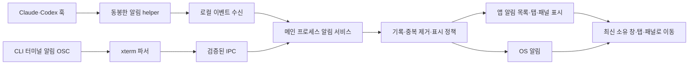

# Passport 제품 전환과 신규 기능 계획

## 1.1.0 구현 반영 — 2026-10-01

후속 사용자 결정에 따라 아래 초기 기획 중 실행·저장 단위를 조정했다. 사이드바 **+**와 새 탭 단축키는 기본 설정으로 로컬 터미널을 즉시 연다. 셸·시작 프로파일·AI 연동 선택은 설정에 두며 SSH는 호스트 화면에서 연다. 템플릿은 작업 탭 **하나와 내부 분할**을 저장하고, 저장 아이콘은 탭 내부 상단에 둔다. 템플릿 카드는 새 탭을 열고 연결하며 배치만 열기도 제공한다. 여러 패널로 묶인 탭 전체의 다른 탭 합치기는 막되 개별 패널 이동·탭 순서 변경은 유지한다.

현재 데이터는 DB 5·문서/portable 2다. 이행 전 백업 후 기존 여러 탭 템플릿만 제외한다. 자세한 현재 동작은 [사용 안내](docs/user-guide.md), 플랫폼별 확인 범위는 [검증 기록](docs/verification.md), 배포 상태는 [릴리즈 목록](docs/releases/README.md)을 따른다. 아래 사전 조사·초기 설계는 결정 당시 기록으로 보존한다.


- 작성일: 2026-10-01
- 상태: 구현 반영 · 대상별 검증 중. 구현 내용과 차이는 [로컬 AI 작업 안내](docs/local-ai-workspaces.md) 참조.
- 기준: Passport 1.0.2 소스와 아래 공식 문서·cmux 소스 조사
- 최초 계획 요청의 산출물: 계획 문서와 사전 검토 기록. 읽기 전용 코드·CLI 도움말 확인, 임시 디렉터리에서의 셸 시작 규칙 확인, 메모리 내 스키마 검증을 수행했다. 앱 코드 수정, CLI 훅 설치, AI 요청·실제 알림 실행, 패키징·배포는 포함하지 않는다.
- 문서 역할: 앞으로 논의하는 신규 기능의 범위·설계·검증 조건을 이 파일에 누적한다. 기존 제품의 요구사항과 구현 이력은 [기존 제품 계획](docs/plan.md), 현재 구조는 [구현 구조](docs/architecture.md)를 따른다.

## 제품 방향: 로컬 AI와 SSH를 함께 사용하는 작업 공간

사용자 목표는 **로컬 터미널에서 AI로 개발 작업을 하고, 같은 화면 옆에 SSH 터미널을 열어 서버 작업도 동시에 할 수 있는 앱**이다. 앱의 첫 화면, 터미널 생성, 분할, 작업 전환을 이 흐름에 맞춰 바꾼다. F01 알림은 이 제품 전환을 뒷받침하는 기능으로 배치한다.

Windows에서는 **Git Bash를 별도로 설치하지 않아도 Passport 설치만으로 `sh`, `ll` 등 익숙한 Unix 계열 명령을 사용할 수 있어야 한다.** 필요한 셸·도구를 앱에 포함한다. Windows는 내장 Bash·cmd·Windows PowerShell·PowerShell 7 중에서, macOS는 기본 로그인 셸·zsh·bash 중에서 사용할 환경을 선택한다. 두 OS 모두 추가 프로파일 없이 사용할지, 여러 프로파일을 적용할지 설정하며 각각의 내용과 적용 순서를 보여준다. 이 요구는 F04에서 다룬다.

제품 소개 문구 초안은 **“내 컴퓨터의 AI 작업과 서버 터미널을 한 화면에서.”**로 한다. 사용자에게 확인된 것은 제품 방향이며, 아래 화면 배치·메뉴 이름·기본값은 그 방향을 구체화한 제안이다. 기존 제품 계획의 호스트 중심 사용 가정은 이 신규 방향으로 갱신하되, 과거 구현 이력은 기존 문서에 보존한다.

### 대표 작업 흐름

1. 앱에서 프로젝트 폴더를 골라 새 작업 탭을 만든다.
2. 해당 폴더의 로컬 터미널에서 Claude Code 또는 Codex를 실행한다.
3. `오른쪽에 추가 → SSH`로 저장한 서버를 열고 로그 확인·명령 실행을 병행한다.
4. 필요하면 로컬 셸이나 다른 AI·SSH 터미널을 더 분할한다.
5. AI 응답 완료나 입력 요청을 알림으로 확인하고 해당 패널로 이동한다.
6. 자주 쓰는 로컬·SSH 조합을 이름 있는 배치로 저장하고 다시 연다.

### 화면 구성 초안

```text
┌─────────────────┬──────────────────────────────────────────────────┐
│ Passport        │ 서비스 개발 · ~/projects/service      ＋  분할  │
│                 ├────────────────────────┬─────────────────────────┤
│ 작업         ＋ │ 로컬 · Claude Code     │ SSH · 개발 서버         │
│ ● 서비스 개발   │ ~/projects/service     │ 사용자@서버             │
│   운영 점검  ②  │                        │                         │
│                 │ AI 코딩·질문·검토      │ 로그 확인·서버 명령     │
│ 저장된 배치     │                        │                         │
│ 호스트          ├────────────────────────┤                         │
│ 파일            │ 로컬 · Codex           │                         │
│ 알림         ②  │ 별도 로컬 세션         │                         │
│ 설정            │                        │                         │
└─────────────────┴────────────────────────┴─────────────────────────┘
```

좌측의 작업 목록을 중심 탐색으로 삼고, 현재 작업의 터미널에 화면 대부분을 배정한다. 첫 기본 배치는 하나의 로컬 패널이며, SSH는 필요할 때 옆에 추가한다. 위 그림의 세 패널은 확장 예시다. 좌측 탐색은 접을 수 있게 하고 기존 최소 창 크기에서 분할 패널의 최소 크기를 지킨다.

| 개념 | 사용자에게 보이는 의미 | 기존 구조와의 관계 |
| --- | --- | --- |
| 작업 탭 | 한 일감에 사용하는 로컬·SSH 터미널 묶음 | 기존 `Workspace`를 사용하고 좌측 세로 목록에서 전환 |
| 터미널 패널 | 독립적으로 실행·입력하는 로컬 셸 또는 SSH 세션 | 기존 `Pane`과 `Split` 재사용 |
| 로컬 AI 터미널 | 로컬 셸에서 Claude Code·Codex를 실행하는 패널 | 로컬 패널에 실행할 CLI 정보를 추가 |
| 저장된 배치 | 여러 작업 탭의 분할·폴더·도구·호스트를 다시 여는 설정 | 기존 `workspaceTemplates`·스페이스 화면을 확장 |
| 호스트 | 작업에 추가할 서버의 주소·인증·접속 설정 | 기존 호스트 관리 유지 |

AI 터미널은 로컬 CLI를 실행하는 방식으로 설계한다. 로그인·모델 선택·대화는 해당 CLI 화면에서 처리하며, 앱은 실행 위치·세션 배치·상태·알림을 맡는다. 로컬 AI와 SSH는 각각 독립 세션이고 입력은 선택한 패널에 전달한다. 두 패널을 나란히 놓는 동작이 AI에 다른 패널의 출력이나 서버 인증 정보를 전달하는 동작으로 이어지지 않게 한다.

## 신규 기능 목록

| ID | 기능 | 상태 | 우선순위 |
| --- | --- | --- | --- |
| F02 | 작업 중심 화면과 로컬·SSH 혼합 터미널 | 계획 작성 | 제품 전환의 기반, 먼저 구현 |
| F04 | Windows·macOS 셸 선택, 시작 프로파일 다중 적용, Windows 내장 Bash·Unix 도구 | 요구사항 반영·계획 작성 | F02의 로컬 실행 기반과 함께 구현 |
| F03 | 프로젝트 폴더에서 로컬 AI 실행·배치 저장 | 계획 작성 | F02 위에 구현 |
| F01 | 로컬 터미널의 Claude Code·Codex 작업 알림 | 계획 작성 | F02·F03의 세션 구조에 연결 |

새 기능을 추가할 때는 별도 ID를 부여하고, 사용자 요청·사용 흐름·기술 범위·검증 조건·미결 사항을 함께 기록한다. 아래 기본값과 단계 구분은 제안이며, 이번 문서 작성이 구현 승인을 뜻하지 않는다.

## 전체 진행 순서

| 단계 | 사용자에게 생기는 변화 | 대상 기능 | 완료 기준 |
| --- | --- | --- | --- |
| 선행 기반 | 기존 데이터를 보존하며 새 셸·프로파일·실행 상태를 저장 | F02·F03·F04 공통 | DB·문서·내보내기 이행, 실행 세대·로더 준비 완료 계약 검증 |
| A 작업 화면·로컬 환경 | 호스트 등록 없이 로컬 작업 시작, Windows·macOS 셸·프로파일 선택, Windows 내장 Unix 환경 제공 | F02·F04 | 혼합 분할, OS별 셸·프로파일, Git Bash·WSL 없는 Windows에서 내장 셸 검증 |
| B AI 작업 시작 | 폴더와 CLI를 선택해 작업을 시작하고 자주 쓰는 배치를 저장 | F03 | 올바른 폴더에서 CLI 실행, Windows 내장 Bash와 실행·알림 연동, 혼합 배치 저장·다시 열기 |
| C 상태와 알림 | 다른 작업 중에도 응답 완료·입력 요청을 알고 정확한 패널로 복귀 | F01 | 지원표의 이벤트, 미확인 표시, 다중 창·OS 클릭 이동 검증 |
| D 통합 검증 | 새 구조에서도 서버·파일·설정과 기존 데이터 사용 가능 | F01~F04 | 대표 사용 흐름과 회귀·이행·설치본 검증 통과 |

사전 검토에서 문서·소스로 확인 가능한 F01 P0와 F04 R0 항목을 먼저 확인했다. 상세 결과와 실제 실행이 필요한 항목은 문서 끝의 `계획 단계 사전 검토 결과`에 기록한다. 구현은 데이터 형식 이행과 셸·실행 세대 계약부터 시작한다. F01 통합은 F02의 패널 식별과 F03의 실행 수명이 정해진 뒤 진행한다. 기능 번호는 논의 순서이며 구현 순서를 뜻하지 않는다.

## F02. 작업 중심 화면과 로컬·SSH 혼합 터미널

### 1. 현재 구조에서 바꿔야 할 지점

현재도 로컬과 SSH를 같은 레이아웃에 표현하는 데이터 구조가 있다. 작업 탭 드래그와 분할 트리를 활용할 수 있지만, 생성·탐색 UI가 SSH 사용을 중심으로 구성돼 있다. 다음 항목은 소스에서 확인한 상태이며 GUI 재현 시험을 수행한 결과는 아니다.

| 현재 모습 | 근거 | 변경안 |
| --- | --- | --- |
| 초기 화면이 호스트 | `App.tsx`의 `active = "hosts"` | 최근 작업 배치 또는 작업 시작 화면 |
| 새 터미널 버튼이 `새 SSH 탭` | `App.tsx` | 공통 `새 터미널` 메뉴 |
| `SSH 연결 열기` 안에 로컬 셸이 있음 | `App.tsx`의 chooser | 로컬·Claude Code·Codex·SSH를 동등한 선택지로 표시 |
| 분할 메뉴에서 SSH 호스트만 선택 | `Workspaces.tsx`의 `HostPicker sshOnly`, `addSplit` | 연결 종류를 고르는 공통 생성·분할 흐름 |
| 로컬을 포함한 수치를 `SSH 연결`로 표시 | `App.tsx`의 상태줄 | 로컬 실행 수와 SSH 연결 수 구분 |
| 저장 배치 안내가 SSH 탭을 전제 | `WorkspaceTemplates.tsx` | 로컬·AI·SSH 혼합 예시와 설명 |
| 패널 제목이 공통 `계정@주소` 형태 | `Workspaces.tsx`의 pane header | 로컬은 폴더·도구, SSH는 호스트·계정 표시 |

### 2. 첫 화면과 탐색

- 설치 직후 호스트가 없어도 `로컬 터미널 시작`, `프로젝트 폴더 열기`, `SSH 연결`을 사용할 수 있게 한다.
- 앱 재시작 시 마지막 작업 배치와 선택 위치를 보여준다. 실행 중 프로세스가 살아 있다고 표시하지 않으며, 로컬·AI 시작과 SSH 연결은 사용자의 실행 동작으로 수행한다.
- 기존 작업 탭을 좌측 작업 목록으로 옮기고, 생성·이름 변경·순서 변경·닫기·별도 창 이동을 제공한다. 가로·세로에 동일한 작업 목록을 중복 배치하지 않는다.
- 호스트·파일·저장된 배치·설정 화면을 보고 돌아와도 실행 중인 터미널과 버퍼는 유지한다.
- 작업 탭 이름은 서버명으로 고정하지 않는다. 프로젝트를 골랐다면 폴더명을 기본 이름으로 제안하고 자유롭게 바꿀 수 있게 한다.
- 새 터미널 메뉴는 현재 작업에 추가할지 새 작업으로 열지와, 새 패널 위치를 선택한다. F03 구현 전에는 일반 로컬 셸과 SSH를 먼저 제공한다.

### 3. 혼합 분할과 입력

어느 패널에서든 `오른쪽에 추가` 또는 `아래에 추가`를 선택한 뒤 새 패널 종류를 고른다. 생성과 분할이 같은 설정 UI와 검증을 사용하도록 공통화한다.

| 현재 패널 | 추가 가능한 패널 |
| --- | --- |
| 로컬 셸 | 로컬 셸, 로컬 AI, SSH |
| 로컬 AI | 로컬 셸, 다른 로컬 AI, SSH |
| SSH | 로컬 셸, 로컬 AI, 다른 SSH |

드래그 분할·새 작업 탭으로 분리·별도 창 이동은 같은 패널 ID와 실행 세션을 유지한다. 동작 중 CLI나 SSH 명령을 다시 실행하지 않는다. 기존 전체 32개 터미널 제한과 최소 패널 크기 제한을 이어 사용한다.

현재 창 최소 크기는 1024×680, 패널 최소 크기는 320×180이며 작업 탭당 최대 16개 패널이다. 좌측 목록을 추가한 뒤에도 이 기준을 사용한다. 공간이 부족하면 분할을 막고 창 확장·목록 접기를 안내한다. 알림 이동은 대상 작업 선택, 집중 보기 해제 또는 대상 변경, 배치 완료 후 터미널 포커스 순서로 처리한다.

새 로컬 패널의 기본 폴더는 해당 작업의 프로젝트 폴더, 없으면 기준 로컬 패널의 **설정된 시작 폴더**, 그것도 없으면 사용자 홈으로 한다. SSH 패널 옆에서 추가할 때 원격 경로를 로컬 경로로 사용하지 않는다. 셸에서 나중에 `cd`한 경로의 자동 추적은 별도 셸 연동 검증 전까지 보장하지 않는다.

각 패널의 키 입력·붙여넣기·IME는 선택한 세션에만 전달한다. 기존 여러 SSH 대상 동시 입력은 현재의 명시적인 SSH 선택 범위에서 유지한다. 로컬 AI 패널이 추가됐다는 이유로 동시 입력 대상에 포함하지 않는다. 종료 확인은 `로컬 세션 N개 · SSH 연결 M개 종료`처럼 실제 영향을 표시하고, 한 패널 종료가 다른 패널의 작업에 영향을 주지 않게 한다.

### 4. 데이터와 구현 경계

- 기존 `Workspace`, `Pane`, `Split`, 창 소유권, xterm 인스턴스 관리, node-pty·SSH 실행기를 재사용한다.
- UI의 터미널 생성 요청을 `로컬 / SSH`와 `추가 위치`로 모델링한다. 현재 로컬 패널의 `LOCAL_HOST_ID` 호환 표현은 경계 내부에 두고 사용자에게 가짜 호스트 선택을 요구하지 않는다.
- 메인 프로세스는 패널 종류에 맞는 실행기로 요청을 분기하고, 잘못된 로컬·SSH 옵션 조합을 거부한다. 렌더러에 로컬 파일 시스템 접근을 개방하지 않는다.
- 선택한 작업·패널 및 탐색 UI 상태는 기존 세션·다중 창 소유권과 맞춰 저장한다. 다른 창의 마지막 선택값으로 현재 창을 덮어쓰지 않는다.
- 기존 저장 데이터와 작업 배치는 이행해서 읽을 수 있어야 한다. 새 필드를 구버전 앱이 삭제하지 않도록 첫 데이터 확장 단계부터 버전 경계를 올린다. UI 용어 변경 때문에 기존 호스트·인증·스니펫·스페이스를 삭제하거나 재등록하게 하지 않는다.

### 5. 검증 조건

1. 호스트가 0개인 초기 상태에서 로컬 셸을 열 수 있고, 이후 서버를 추가해 나란히 사용할 수 있다.
2. 로컬→SSH, SSH→로컬, 로컬→로컬, SSH→SSH 분할과 작업 탭 간 이동이 모두 동작한다.
3. 좌측 작업 전환·호스트/파일 화면 전환·집중 보기·다중 창 이동 중 프로세스와 스크롤백이 유지된다.
4. 한 패널에서 한글 입력·여러 줄 붙여넣기를 해도 다른 패널에 입력되지 않는다.
5. SSH 접속 실패·재연결·종료 중에도 같은 작업의 로컬 AI 실행이 유지된다. 로컬 CLI 종료도 SSH 연결에 영향을 주지 않는다.
6. 제목·상태·종료 확인에 로컬과 SSH가 정확히 구분되며, 기존 단축키와 접근성 조작을 사용할 수 있다.

## F03. 프로젝트 폴더에서 로컬 AI 실행·배치 저장

### 1. 실행 흐름

프로젝트 폴더는 메인 프로세스의 폴더 선택 대화상자로 지정한다. 새 터미널에서 `로컬 셸 / Claude Code / Codex / SSH`를 선택하고 필요한 값만 입력한다. AI를 선택하면 로컬 경로, 사용할 CLI의 설치 상태, 새 패널 위치를 보여준다. SSH를 선택하면 기존 호스트 선택과 인증 흐름으로 이어진다.

CLI 설치·로그인은 사용자가 설치한 도구를 이용한다. 설치되지 않았으면 해당 상태와 일반 로컬 셸을 여는 동작을 제공한다. 선택 버튼이 가짜 실행 상태나 빈 AI 화면을 만들지 않게 한다. 앱 전용 모델 API나 API 키 입력 화면은 이 기능의 구성 요소로 추가하지 않는다.

Windows의 새 사용자에게는 F04의 내장 Bash와 기본 편의 프로파일을 초기 조합으로 제안한다. 실제 실행에는 설정에서 선택한 셸과 프로파일 목록을 사용하며, 추가 프로파일을 모두 끌 수도 있다. Bash·기본 Unix 도구는 Passport가 제공하고, Claude Code·Codex 자체의 설치·로그인은 위 흐름으로 구분한다. 두 CLI가 내장 런타임의 실행 파일·경로를 어떻게 인식하는지는 설치 버전별로 검증하며, 시스템 Git Bash 설치를 요구하는 경로로 되돌아가지 않는다.

현재 Claude 공식 문서는 Windows에서 Git for Windows 없이 PowerShell 도구로 실행하는 경로와 `CLAUDE_CODE_GIT_BASH_PATH`로 Bash 위치를 지정하는 경로를 모두 안내한다. Passport Bash 조합은 해당 세션에만 내장 `bin/bash.exe` 경로를 전달하는 안을 검증한다. 터미널에서 선택한 셸과 AI가 내부 명령에 사용하는 셸은 별개이므로, Bash 패널에서 Codex를 실행했다고 AI의 모든 명령이 Bash로 바뀐다고 표시하지 않는다. [Claude Windows 설정](https://code.claude.com/docs/en/setup), [Codex Windows 환경](https://learn.chatgpt.com/docs/windows/windows-sandbox)

CLI 실행 버튼은 **새로 만든 로컬 패널**에서 명시적으로 실행한다. 작업 중인 셸에 지연 타이머로 명령 문자열을 밀어 넣는 방식은 사용하지 않는다. 실제 실행 파일 경로·인자·작업 디렉터리를 구분해 전달하고, 로그인 셸의 환경 준비와 CLI 시작을 연결하는 방법은 구현 전 작은 실행 검증으로 확정한다. 이 검증에는 공백·한글·셸 특수 문자가 있는 경로, `Ctrl+C`, CLI 종료 후 셸로 돌아가기, 다시 실행하기를 포함한다.

메인은 실행 파일 탐색·설정 해석 → PTY 시작 → 로더 준비 완료 → AI 실행 요청을 별도 상태로 관리한다. 로더는 실행 세대에 묶인 일회성 시작 요청을 소비하고 같은 CLI를 두 번 실행하지 않는다. 초기화가 끝나지 않거나 실패하면 셸 화면과 원인을 보여주고 AI 자동 시작은 중단한다. 창 이동은 실행 세대를 유지하고 재시작만 새 세대를 발급한다.

CLI 탐색은 선택한 셸에서 실제 사용될 PATH와 실행 파일을 확인하고 이름·버전·경로를 보여준다. Finder·시작 메뉴에서 실행한 앱의 PATH만으로 미설치를 단정하지 않는다. 임의 셸 설정을 실행하는 환경 진단은 사용자의 새 터미널 열기·명시적 진단 때만 수행한다. 네이티브 실행 파일과 npm의 `.cmd` 같은 래퍼는 실행 규칙을 구분한다.

같은 작업에서 Claude와 Codex를 함께 열 수 있다. 각 CLI의 프로세스·대화·입력은 독립적으로 유지하며, 같은 프로젝트 폴더를 사용하는 것은 파일 시스템을 공유한다는 뜻이다. 파일 충돌의 자동 조정이나 에이전트 간 자동 협업은 별도 기능으로 취급한다.

### 2. 배치 저장과 다시 열기

프로젝트 폴더, 패널별 시작 폴더·로컬 셸·AI 도구, SSH 호스트 참조, 분할 방향·비율·선택 패널을 저장한다. 기존 `스페이스` 화면은 `저장된 배치`라는 사용자 용어로 정리한다.

- `배치 열기`는 레이아웃을 만들고 실행 전 상태로 보여준다.
- `열고 시작`은 저장된 로컬·AI 패널 실행과 SSH 연결을 요청하는 별도 동작이다. SSH 인증 요청은 기존 흐름으로 처리하고 일부 실패가 다른 패널의 시작을 취소하지 않게 한다.
- 목록 미리보기, 가져오기, 앱 재시작만으로 AI 명령을 자동 실행하지 않는다.
- 다시 열 때 작업·패널 ID는 기존 복제 규칙처럼 새로 발급한다. 알림 실행 세대, 프로세스 ID, 연결 토큰, CLI 대화 식별자를 배치에 저장하지 않는다.
- 사라진 로컬 폴더는 재선택하고, 삭제된 SSH 호스트는 현재 정리 규칙을 따른다. 다른 기기로 가져온 경로·실행 파일은 재확인하며 배치만으로 연동 훅을 설치하지 않는다.

### 3. 데이터·상태 설계

`Workspace`에는 선택적인 프로젝트 시작 폴더, 로컬 `Pane`에는 선택적인 CLI 실행 프로필을 추가하는 안을 우선 사용한다. 프로필은 도구 식별자와 실행에 필요한 검증된 옵션만 담는다. `local.cwd`는 패널별 실제 시작 폴더로 두고, 작업의 프로젝트 폴더는 새 패널을 만들 때의 기본값으로 사용한다. 새 필드는 생략 가능한 값으로 도입해 이전 데이터는 일반 로컬 셸로 읽는다.

`cloneWorkspaces`, 저장 배치, 내보내기·가져오기에서 새 메타데이터의 복사·경로 처리·검증을 함께 수정한다. 패널 종류를 사용자 지정 문자열 제목에서 추측하지 않으며, 저장된 실행 프로필과 실제 실행 상태를 구분한다.

| 상태 정보 | 표시 근거 |
| --- | --- |
| 로컬 실행·SSH 연결·종료·오류 | 해당 프로세스·연결의 실제 생명주기 |
| 실행하도록 지정한 Claude·Codex | 새 터미널의 실행 프로필 |
| AI 처리 중·응답 완료·승인/답변 필요 | F01의 검증된 CLI 이벤트 |
| 일반 셸에서 사용자가 직접 실행한 AI | F01 연동이 식별한 경우만 도구·상태 표시 |

단순히 CLI 프로세스가 살아 있다는 이유로 `AI 처리 중`으로 표시하지 않는다. 알림 연동을 꺼도 로컬 AI·SSH 생성과 혼합 분할은 사용할 수 있어야 한다.

새 로컬·AI 세션의 출력 파일 기록은 기본 끔으로 하고, 패널에서 기록을 켠 경우 시작한다. 현재 공통 `autoLog=true`가 로컬 출력까지 기록하므로 연결 종류별 설정으로 분리한다. 기존 SSH 기록 설정과 이미 저장된 로그는 유지한다. 화면 스크롤백, 출력 파일 기록, 알림 기록은 각각 별도이며 알림 미리보기를 끄는 것만으로 터미널 로그가 꺼졌다고 안내하지 않는다.

### 4. 검증과 구현 위치

프로젝트 경로의 존재·권한 오류, CLI 미설치·실행 실패·로그인 대기, 한글·공백 경로, CLI 중단·종료·재실행, 혼합 배치의 두 번 열기와 부분 연결 실패, 이전 스페이스 가져오기를 검증한다. Claude·Codex의 실제 실행과 F01 이벤트 식별은 설치된 CLI 버전을 명시해 확인한다.

| 위치 | F02·F03 변경 책임 |
| --- | --- |
| `src/renderer/App.tsx`, `styles.css` | 작업 중심 탐색·시작 화면·작업 생성·상태줄 |
| `src/renderer/TerminalPicker.tsx` 신규 후보 | 로컬·AI·SSH 공통 생성과 분할 대상 선택 |
| `src/renderer/Workspaces.tsx`, `HostPicker.tsx` | 혼합 분할·패널 제목·생명주기 조작 |
| `src/renderer/WorkspaceTemplates.tsx` | 저장된 배치와 명시적인 열기·시작 |
| `src/shared/model.ts`, `workspace-templates.ts`, `advanced.ts` | 시작 폴더·실행 프로필·호환 스키마·복제·표시 모델 |
| `src/main/local.ts`, `index.ts`, `src/preload/index.ts` | 폴더 선택·CLI 확인·실행·중단·세션 소유권 |
| `src/main/portable.ts`, `store.ts` | 이전 데이터와 신규 필드의 저장·이동 호환성 |
| `tests/`, `README.md`, `docs/user-guide.md` | 대표 동시 작업 시나리오, 제품 소개·사용법 갱신 |

제품 소개·스크린샷은 혼합 작업이 실제로 구현·검증된 뒤 갱신한다. 현재 문서 작성 단계에서 배포된 앱이 새 기능을 지원한다고 안내하지 않는다.

## F04. Windows·macOS 셸 선택·시작 프로파일과 Windows 내장 Bash

### 1. 사용자 요구와 현재 상태

사용자는 Windows에서 익숙한 `sh`, `ll` 같은 명령이 없어 불편한 문제를 해결하고 싶어 한다. 핵심 요구는 이미 설치된 Git Bash를 선택하는 메뉴가 아니라, **Passport가 필요한 실행 환경을 제공하고 터미널을 열 때 추가 프로파일을 적용하는 것**이다. Git Bash·Git for Windows·MSYS2·WSL의 사전 설치를 요구하지 않는다.

사용자는 설정에서 추가 프로파일 적용 여부, 기본 조합, 여러 프로파일 선택을 직접 관리하고 **어떤 설정이 들어가는지 확인한 뒤 선택**할 수 있어야 한다. 기본 환경 선택과 추가 프로파일 선택을 구분하고, 둘을 합친 최종 실행 구성을 보여준다.

현재 [로컬 실행 코드](src/main/local.ts)는 Windows에서 PowerShell·cmd, macOS에서 기본 셸·zsh·bash를 탐색한다. Windows 실행 인자는 cmd 또는 그 외로 나누며, macOS에는 로그인 옵션 `-l`을 전달한다. PowerShell 7과 Windows PowerShell은 같은 `powershell` 식별자를 사용해 두 버전을 독립적으로 선택할 수 없다. [로컬 셸 설정](src/shared/model.ts)은 셸 종류와 시작 폴더만 저장한다. 앱이 제공하는 Bash 실행기, Unix 도구 번들, 추가 시작 프로파일은 아직 없다.

| 구성 | 맡는 일 | 프로파일만으로 가능한지 |
| --- | --- | --- |
| Bash·`sh` 실행기 | 셸 문법, 변수, 파이프, 조건·반복, `.sh` 스크립트 실행 | 실행 프로그램과 런타임이 필요 |
| Unix 명령어 도구 | `ls`, `cat`, `grep`, `sed`, `awk`, `find` 등 | 해당 프로그램을 포함해야 함 |
| Passport 시작 프로파일 | `ll` 별칭, 프롬프트, 세션 환경, 연동 초기화 | 셸 시작 시 로드 가능 |

PowerShell 프로파일에도 별칭과 함수를 넣을 수 있지만, 이름이 비슷한 명령을 등록하는 것만으로 Bash 문법이나 Unix 명령의 옵션까지 호환되지는 않는다. `sh`를 PowerShell 실행의 별칭으로 처리하지 않는다. [Microsoft PowerShell Profiles](https://learn.microsoft.com/en-us/powershell/module/microsoft.powershell.core/about/about_profiles)

### 2. Windows·macOS 지원 가능성과 셸 선택

공식 시작 옵션과 현재 실행 구조를 검토하면 **두 OS 모두 셸을 선택하고 해당 세션에 시작 프로파일을 추가하는 설계가 가능하다.** 공통 설정 UI 아래에 셸별 로더를 둔다. 아래는 구현 목표이며, 모든 셸에 같은 스크립트를 전달해 동작한다고 가정하지 않는다.

| OS | 설정·새 터미널에서 선택할 환경 | 실행 파일과 제공 조건 | 시작 프로파일 적용 범위 |
| --- | --- | --- | --- |
| Windows | Passport Bash | 앱에 포함할 `bin/bash.exe`; 외부 Git Bash·WSL 불필요 | Bash 별칭·함수, 환경·PATH, 프롬프트·연동 |
| Windows | 명령 프롬프트(cmd) | 시스템 `cmd.exe` | 세션 환경·PATH, `doskey` 매크로, cmd 프롬프트 |
| Windows | Windows PowerShell 5.1 | 시스템 `powershell.exe` | PowerShell 별칭·함수, 환경·PATH, 프롬프트·연동 |
| Windows | PowerShell 7 | 설치된 `pwsh.exe`; 발견한 경우 선택 가능 | 해당 버전용 PowerShell 프로파일; 5.1과 별도 선택 |
| macOS | 기본 로그인 셸 | 실제 해석한 실행 파일을 표시; 초기 지원은 zsh·bash | 해석된 셸에 맞는 프로파일 |
| macOS | zsh | 기본 `/bin/zsh` | zsh 별칭·함수, 환경·PATH, 프롬프트·연동 |
| macOS | bash | 기본 `/bin/bash` | 설치 버전에 맞는 Bash 별칭·함수, 환경·PATH, 프롬프트·연동 |

Windows에서는 **cmd로 열기와 PowerShell로 열기를 사용자가 직접 선택**한다. PowerShell 7이 설치됐다는 이유로 Windows PowerShell 5.1 선택을 바꾸지 않는다. 선택 항목에는 이름·버전·실행 경로·아키텍처·사용 가능 여부를 보여주고, 없는 실행 파일은 이유와 함께 비활성화한다. 새 터미널 메뉴에서도 현재 기본값을 확인하고 이번 패널의 셸만 바꿀 수 있게 한다.

새 Windows 사용자의 앱 기본값은 Unix 명령 사용 요구에 맞춰 `Passport Bash + Unix 단축명령`으로 제안한다. cmd·Windows PowerShell·PowerShell 7을 기본값으로 저장하는 것도 지원한다. 기존 사용자의 명시적 셸 선택은 보존하고, 기존 `default`와 `powershell` 값은 이행 시 현재 해석되는 실행 환경을 기록한다. 이후 해당 실행 파일이 사라지면 다시 선택하게 하며 다른 셸로 자동 전환하지 않는다.

macOS의 초기 기본값은 사용자의 지원되는 로그인 셸을 따르고, 설정이 없으면 zsh를 사용한다. Apple도 기본 셸을 zsh로 안내한다. 현재 코드가 참조하는 `SHELL` 환경 변수와 실제 로그인 셸이 다를 수 있으므로 탐색 결과의 경로를 노출한다. 지원하지 않는 셸은 프로파일 호환 여부를 별도로 표시한다. [Apple 기본 셸 안내](https://support.apple.com/guide/terminal/change-the-default-shell-trml113/mac)

새 Mac 사용자의 추가 프로파일 기본값은 `사용 안 함`으로 두고 Unix 단축명령·AI 연동을 선택할 수 있게 한다. 셸을 바꿀 때 기존 선택 프로파일의 호환 여부를 다시 보여주며, 호환되지 않는 항목을 조용히 바꾸거나 실행하지 않는다.

Mac에서는 OS의 셸·Unix 도구를 활용하므로 Windows용 런타임을 받지 않는다. Homebrew, 외부 Git Bash, 새 Bash 설치를 기본 사용의 전제로 두지 않는다. Git 프롬프트처럼 추가 프로그램이 필요한 프로파일은 해당 실행 파일이 있을 때 활성화한다.

### 3. Windows 내장 실행 환경 제공 방식

첫 구현은 **공식 Git for Windows의 Portable 배포물을 앱 내부 런타임으로 포함하고, 여기에 Passport 전용 시작 프로파일을 적용하는 방식**을 우선 검증한다. 사용자는 Passport만 설치하며 내부 배포물은 구현에 사용하는 구성 요소다. 공식 페이지에 x64 Portable 패키지가 제공된다. [Git for Windows 다운로드](https://git-scm.com/install/windows)

기본 사용자 흐름은 다음과 같다.

```text
Passport 설치
  → 새 로컬 터미널
  → 설정에서 선택한 기본 환경 실행
  → 선택한 추가 프로파일을 순서대로 로드 또는 생략
  → 내장 Bash에서는 sh·ls, 편의 프로파일에서는 ll 등을 사용
```

- 설치본에 런타임을 함께 넣어, 설치 후 첫 터미널 실행에도 별도 다운로드를 요구하지 않는다.
- 런타임의 실행 파일·DLL·기본 설정을 하나의 버전 묶음으로 관리한다. 용량 축소를 위한 임의 파일 제거는 하지 않는다. 아래 사용자 시작 파일 자동 생성처럼 제품 동작과 충돌하는 초기화는 근거·패치·검증 항목을 기록하고 앱 내부 사본에만 조정한다.
- Bash는 기존 node-pty와 xterm 패널 안에서 실행한다. 외부 터미널 창을 여는 런처 대신 내장 런타임의 `bin/bash.exe` 진입점을 사용한다.
- Git for Windows의 Bash 진입점은 필요한 환경을 준비해 실제 Bash를 실행한다. 이 초기화를 보존하며, 런타임의 내부 디렉터리를 시스템 전체 PATH에 추가하지 않는다. [Git wrapper 문서](https://gitforwindows.org/git-wrapper.html)
- 새 Windows 사용자의 초기 조합은 `Passport Bash + Unix 단축명령`으로 제안하고 첫 설정 화면에 표시한다. 사용자가 기본 셸과 추가 프로파일을 바꿀 수 있으며, 명시적으로 PowerShell·cmd를 사용하는 기존 배치는 해당 선택을 유지한다.
- macOS는 기존 셸을 사용한다. Windows용 실행 파일을 Mac 패키지에 포함하지 않는다.

사전 소스 검토에서 Git for Windows의 `etc/profile.d/bash_profile.sh`가 `.bashrc`만 있는 사용자에게 `.bash_profile`을 자동 생성하는 동작을 확인했다. **원본 Portable 배포물을 그대로 실행하는 것만으로 사용자 설정 불변을 보장할 수 없다.** 앱 번들의 이 자동 생성 스크립트를 비활성화하는 명시적 패치를 두고, `.bashrc` 연결은 Passport 로더가 메모리 안에서 처리한다. 패치는 사용자 홈에 적용하지 않으며 원본·변경 내역을 번들 manifest에 남긴다. 프로파일 파일의 신규 생성·수정이 없는지 기존 파일 조합별로 시험한다. [공식 자동 생성 스크립트](https://github.com/git-for-windows/build-extra/blob/main/git-extra/bash_profile.sh), [공식 패키징 목록](https://github.com/git-for-windows/build-extra/blob/main/git-extra/PKGBUILD)

여기서 호환 목표는 Bash 문법과 명시한 Unix 도구 사용이다. Linux 커널·배포판·패키지 관리 환경을 제공하는 것으로 안내하지 않는다. 같은 Windows 파일을 다루므로 로컬 AI 작업과 파일 보기·SSH 패널을 기존 흐름대로 병행할 수 있다.

### 4. 설정에서 선택·확인하는 흐름

`설정 → 터미널 환경`에 기본 환경과 추가 프로파일을 함께 관리하는 화면을 둔다. 기존 SSH 인증 프로필과 구분해 이 화면에서는 `시작 프로파일`이라고 부른다.

#### 기본 환경과 추가 적용 모드

| 설정 | 선택과 의미 |
| --- | --- |
| 기본 실행 환경 | Windows: `Passport Bash / cmd / Windows PowerShell 5.1 / PowerShell 7`; macOS: `기본 로그인 셸 / zsh / bash` 중 하나 선택 |
| 추가 프로파일 | `사용 안 함 / 선택해서 적용` 중 선택 |
| 기본 조합 저장 | 선택한 셸·프로파일 목록·순서를 새 터미널의 기본값으로 저장 |
| 프로젝트별 설정 | `앱 기본값 사용 / 추가 프로파일 없음 / 이 프로젝트에서 직접 선택` |
| 새 터미널의 이번 설정 | 현재 상속 결과를 표시하고 이번 패널만 다른 조합 선택 가능 |

`사용 안 함`은 Passport가 추가하는 편의·연동 프로파일을 생략한다는 뜻이다. 셸 실행에 필요한 런타임 초기화와 원래 사용자 셸 설정은 별도로 표시한다. 내장 Bash에서 추가 프로파일을 꺼도 포함된 `sh`·`ls`는 사용할 수 있다. 기존 사용자 설정이나 런타임이 이미 정의한 `ll`까지 지우지는 않는다.

여러 프로파일은 한 셸에 순서대로 적용할 설정 묶음이다. Bash와 PowerShell 두 개를 한 패널에 동시에 실행하는 조합으로 해석하지 않는다. 선택한 셸·OS와 호환되는 프로파일만 적용할 수 있게 한다.

#### 프로파일 목록과 상세 보기

체크박스로 여러 항목을 고르고, 드래그 또는 위·아래 버튼으로 순서를 바꾼다. 내장 프로파일은 내용 보기·복제를 제공하고, 사용자 프로파일은 추가·편집·복제·삭제할 수 있게 한다. 첫 범위의 사용자 프로파일은 별칭·환경 변수·PATH 같은 구조화한 항목으로 작성한다. 임의 시작 스크립트 파일 실행은 후속 확장 후보로 두어, 현재 미리보기가 보여주는 내용과 실제 적용 범위를 일치시킨다.

| 프로파일 예시 | 목록에서 보여줄 요약 | 적용 조건 |
| --- | --- | --- |
| Unix 단축명령 | `ll → ls -l`, `la → ls -A` | Windows 내장 Bash, macOS zsh·bash |
| Git 프롬프트 | 현재 폴더·브랜치 표시 | 지원 셸용 구현과 Git 필요 |
| AI 작업 알림 | Claude·Codex 이벤트를 Passport에 전달 | F01의 해당 도구 연동 지원·활성 상태 필요 |
| 내 개발 환경 | 사용자가 작성한 환경 변수·별칭·PATH 항목 | 항목별 지원 셸·로컬 경로 확인 |

위 목록은 초기 프로파일 구성안이다. 단순한 이름만으로 모든 설정을 켜지 않으며, 상세 보기에는 다음을 표시한다.

- 이름, 설명, 제공자(`Passport 기본 / 사용자 작성`), 버전, 지원 셸·OS.
- 추가할 별칭·함수, 환경 변수, PATH 경로와 삽입 위치, 프롬프트 변경.
- 초기화 동작·연동 훅과 그 목적, 필요한 실행 파일, 적용 가능한 상태.
- 각 항목의 켜짐 여부, 이미 같은 항목이 있을 때의 처리, 최종 적용 순서.
- 사용자가 확인하려는 경우 생성할 셸 설정의 원문 보기. 비밀값은 가리고 저장 설정에는 자격 증명 원문을 넣지 않는다.

프로파일 선택은 필요한 프로그램이 없는 상태를 숨기지 않는다. 지원되지 않는 셸, 없는 로컬 경로, 비활성화된 AI 연동은 이유와 함께 표시하고 실행 가능한 조합으로 수정할 수 있게 한다. 임의 소프트웨어 설치나 셸 교체를 자동으로 수행하지 않는다.

#### 설정 화면 초안

```text
터미널 환경
  기본 환경       [ Passport Bash ▾ ]
                  Windows: Passport Bash / cmd / Windows PowerShell 5.1 / PowerShell 7
                  macOS: 기본 로그인 셸 / zsh / bash
  추가 프로파일   ( ) 사용 안 함   (●) 선택해서 적용

  적용 순서   선택   프로파일          내용
     1         ☑    Unix 단축명령     ll·la 별칭             [상세]
     2         ☑    Git 프롬프트      폴더·브랜치 표시        [상세]
               ☐    AI 작업 알림      Claude·Codex 알림      [상세]
               ☐    내 개발 환경      환경 변수·PATH         [편집]

  [프로파일 추가]   [최종 적용 내용 보기]
  [기본값으로 저장] [이 설정으로 새 터미널 열기]
```

설정 미리보기만으로 프로파일을 실행하지 않는다. `최종 적용 내용`에는 런타임·기존 사용자 설정·선택한 프로파일의 출처를 나눠 보여준다. 사용자 셸 설정은 실행 전 정적으로 확정할 수 없는 값이 있으므로 `실행 시 확인`이라고 표시한다. 새 터미널을 연 뒤 패널 메뉴의 `적용된 환경 보기`에서 실제 적용한 프로파일 버전, 순서, 성공·생략·충돌 결과를 확인할 수 있게 한다.

#### 여러 프로파일의 충돌과 적용 범위

- 기본 적용 순서는 `런타임 초기화 → 기존 사용자 설정 → 선택한 프로파일의 위에서 아래 순서`다.
- 별칭·함수·일반 환경 변수의 같은 이름은 기본적으로 기존 값을 유지하고 후속 정의를 생략한다. 덮어쓰기를 원하는 항목만 사용자가 명시적으로 선택하며, 미리보기에 바뀌는 값과 출처를 표시한다.
- 프로파일들이 같은 PATH 경로를 넣으면 중복 제거한다. `앞에 추가할 경로(선택 순서) → 기존 PATH → 뒤에 추가할 경로(선택 순서)`로 한 번에 구성해 반복 prepend 때문에 순서가 뒤집히지 않게 한다. Windows와 macOS의 경로 비교 규칙을 구분한다.
- 프롬프트처럼 한 번에 하나만 적용할 항목은 충돌을 표시해 사용할 항목을 고르게 한다. 목록 순서만으로 조용히 교체하지 않는다.
- `HOME`, `USERPROFILE`, 런타임 식별 값, Passport의 연결 토큰·세션 ID 같은 필수 환경은 일반 환경 변수 편집에서 제외한다.
- 앱 기본값을 상속하면 해당 목록 전체를 사용한다. 프로젝트·패널에서 직접 선택하면 그 목록으로 대체한다. `추가 프로파일 없음`도 명시적 선택으로 보존해 기본값과 자동 병합되지 않게 한다.
- 변경은 다음에 여는 터미널부터 적용한다. 실행 중인 AI·SSH 세션에는 설정 명령을 보내지 않고, 패널에는 현재 적용 중인 구성과 다음 실행 구성이 다름을 표시한다.
- AI 작업 알림 프로파일은 F01의 연동 설정을 참조한다. 같은 훅을 두 번 설치하지 않으며, 선택하지 않은 세션은 알림 훅을 주입하지 않는다. 셸·프로파일 선택 화면과 F01 설정이 서로 다른 활성 상태를 저장하지 않게 한다.
- 프로파일을 삭제할 때 참조하는 기본값·프로젝트·저장 배치를 표시한다. 참조를 정리한 뒤 삭제하고 다른 프로파일을 임의로 대신 선택하지 않는다.

### 5. 시작 프로파일의 역할과 셸별 적용 방식

앱이 관리하는 로더가 선택한 시작 프로파일 목록을 새 로컬 세션에 적용한다. `사용 안 함`이면 추가 목록을 생략한다. 사용자 홈의 `.zshrc`, `.zprofile`, `.bashrc`, `.bash_profile`, PowerShell 프로파일이나 cmd의 AutoRun 레지스트리를 자동 수정하는 방식은 사용하지 않는다.

1. 내장 런타임에 필요한 환경과 기본 시작 설정을 준비한다.
2. 선택한 셸에서 적용하기로 한 기존 사용자 설정을 한 번 읽는다.
3. 선택된 프로파일을 지정 순서로 추가 적용해 별칭·표시·연동을 준비한다. 충돌 항목은 위의 유지·명시적 덮어쓰기 규칙을 따르고 적용 결과를 기록한다.
4. 설정한 프로젝트 폴더에서 프롬프트를 표시한 후, F03의 명시적 AI 실행 요청을 처리한다.

Bash의 로그인 설정과 대화형 rc 파일은 읽는 조건이 다르다. 이번 격리 확인에서 시스템 Bash 3.2는 대화형 `--rcfile`을 읽었지만 로그인 옵션을 더하면 해당 파일을 읽지 않았다. 따라서 기존 `-l`에 rc 옵션만 추가하는 설계는 제외한다. 추가 프로파일 사용 시 제어된 대화형 rc 로더에서 로그인 초기화 파일을 연결하는 안을 우선 사용한다. 이는 네이티브 로그인 셸 플래그·로그아웃 동작과 같다고 가정할 수 없으므로 실제 로그인 여부에 의존하는 사용자 설정은 별도 호환 검증 대상으로 둔다. [Bash 시작 파일 문서](https://www.gnu.org/software/bash/manual/html_node/Bash-Startup-Files.html), [VS Code Bash 로더 참고](https://github.com/microsoft/vscode/blob/main/src/vs/workbench/contrib/terminal/common/scripts/shellIntegration-bash.sh)

#### Windows: cmd와 PowerShell의 실행 구분

- **cmd:** 추가 프로파일이 없으면 기존처럼 `cmd.exe`를 실행한다. 적용할 때는 `/k`로 앱이 생성한 `.cmd` 로더를 실행하고 프롬프트를 유지한다. 여러 설정은 같은 세션에서 순서대로 적용한다. `/c`로 초기화 후 셸이 종료되게 하지 않으며, `/d`는 기존 AutoRun을 끄므로 기본으로 덧붙이지 않는다. [Microsoft cmd 실행 옵션](https://learn.microsoft.com/en-us/windows-server/administration/windows-commands/cmd)
- **Windows PowerShell 5.1 / PowerShell 7:** 각각 `powershell.exe`와 `pwsh.exe`를 실행한다. 추가 적용 시 `-NoLogo -NoExit`와 로더 실행 인자를 조합하고, 프로파일의 별칭·함수가 대화형 세션에 남는 범위를 검증한다. 기존 사용자 프로파일을 유지하는 모드에서 `-NoProfile`을 자동 추가하지 않는다. [Windows PowerShell 실행 옵션](https://learn.microsoft.com/en-us/powershell/module/microsoft.powershell.core/about/about_powershell_exe?view=powershell-5.1), [PowerShell 7 실행 옵션](https://learn.microsoft.com/en-us/powershell/module/microsoft.powershell.core/about/about_pwsh?view=powershell-7.6)
- **PowerShell 적용 실패:** 실행 정책이 `.ps1` 로더를 막는 경우를 확인한다. 앱이 시스템 정책을 바꾸거나 실행 정책 우회 옵션을 기본 삽입하지 않는다. 셸은 유지하고 추가 프로파일의 실패 이유와 적용 결과를 표시한다. 해당 정책 아래에서 가능한 환경·PATH 설정과 실패한 스크립트 항목을 구분한다. [PowerShell 실행 정책](https://learn.microsoft.com/en-us/powershell/module/microsoft.powershell.core/about/about_execution_policies?view=powershell-7.6)

cmd의 `doskey`는 대화형 명령 매크로이며 배치 파일에서는 그대로 사용할 수 없다. PowerShell 함수·Bash 별칭과 지원 범위가 다르므로 설정 상세에 `대화형 전용`을 표시한다. Bash용 프로파일을 cmd나 PowerShell에 그대로 주입하지 않는다. [Microsoft doskey 문서](https://learn.microsoft.com/en-us/windows-server/administration/windows-commands/doskey)

Git Bash와 같은 문법·Unix 옵션의 기준 환경은 `Passport Bash`다. cmd·PowerShell은 선택한 셸의 원래 문법을 유지한다. 이들에서도 내장 Bash를 명시적으로 실행할 수 있도록 경로를 안내한다. `sh`·Unix 도구를 바로 호출하는 추가 연결 프로파일은 전용 래퍼의 인자·종료 코드·기존 명령 충돌을 검증한 뒤 제공하는 확장 항목으로 둔다. MSYS 내부 디렉터리 전체를 cmd·PowerShell의 PATH 앞에 넣는 방식은 피한다. `ll → dir` 같은 설정은 Windows용 편의 명령으로 표시하고 `ls -l`과 같은 동작이라고 안내하지 않는다.

#### macOS: zsh와 bash의 실행 구분

- **zsh:** 로그인·대화형 셸을 기준으로, 앱이 관리하는 임시 `ZDOTDIR`와 시작 파일을 이용해 기존 설정을 이어 읽는 방식을 검증한다. `.zshenv → .zprofile → .zshrc → .zlogin`의 해당 조건과 시스템 설정 순서를 보존한다. 원래 `ZDOTDIR`·사용자 파일을 한 번씩 연결하고, 초기화 후 자식 셸·히스토리·로그아웃이 임시 디렉터리에 묶이지 않게 한다. 사용자가 `RCS` 등으로 로드를 막은 경우에는 생략 상태를 표시한다. [zsh 시작 파일 문서](https://zsh.sourceforge.io/Doc/Release/Files.html)
- **bash:** 시스템 `/bin/bash`의 설치 버전을 기준으로 로더를 생성한다. Bash 3.2에서도 동작하게 하고 Bash 4 이상 기능을 필수로 쓰지 않는다. 로그인 초기화 모드에서는 시스템 profile 다음 `.bash_profile / .bash_login / .profile` 중 읽을 수 있는 첫 파일을 연결하고 `.bashrc`를 별도로 무조건 읽지 않는다. 일반 대화형 모드는 사용자 `.bashrc`를 연결한다. 실제 사용자 구성·종료 훅과 Windows 번들 초기화의 공존은 R0 설치본 검증 항목이다.
- **명령 옵션:** Mac의 시스템 도구와 Windows 번들의 GNU 계열 도구는 옵션 차이가 있다. 공통 `ll`은 `ls -l`을 기본으로 하며, 색상·확장 옵션은 OS별 지원 여부를 확인한다. Mac에 GNU 도구가 있다고 가정해 Windows용 인자를 그대로 생성하지 않는다.

#### Windows 내장 Bash의 기본 명령 범위

| 기본 제공 항목 | 목표 동작 |
| --- | --- |
| `sh script.sh`, `bash script.sh` | 포함한 셸로 스크립트 실행, 인자·표준 입출력·종료 코드 유지 |
| `ls`, `cat`, `cp`, `mv`, `mkdir`, `rm` | 포함한 Unix 도구의 실제 옵션과 동작 사용 |
| `grep`, `sed`, `awk`, `find`, `less`, `tar` | 기준 런타임에서 제공 여부를 확인하고 배포 검증 목록에 고정 |
| `ll` | Unix 단축명령 프로파일 선택 시 대화형 기본 별칭 `ls -l`; 사용자가 지정한 별칭·함수 우선 |
| `git` | 번들에 포함된 실행 파일 사용, 기존 사용자 Git 설정 존중 |
| `pwd`, `cd`, 환경 변수·파이프·리디렉션 | 실제 Bash의 문법과 작업 디렉터리 동작 |

`ll`은 대화형 편의 별칭이다. 비대화형 `.sh` 스크립트에는 `ls -l` 같은 실제 명령 사용을 기준으로 하고, 모든 자식 스크립트에 별칭을 강제 주입하지 않는다. 프로파일의 추가 편의 설정을 끄거나 사용자 별칭을 관리하는 기능은 셸 실행 환경과 분리한다.

### 6. 경로·실행·패키징 설계

- 기존의 Windows 인자 공통 처리 대신 셸별 실행 명세를 둔다. 실행 파일, 인자 배열, 시작 폴더, 프로파일 로더, 세션 환경을 각각 검증한다. Bash에 PowerShell의 `-NoLogo`가 전달되지 않게 한다.
- 실행 환경과 프로파일은 별개로 모델링한다. 프로파일 정의는 `id / name / revision / origin / supportedShells / platforms / entries`를 기본안으로 하고, 구조화한 항목에 충돌 처리 정책을 둔다. 런타임 설치 경로는 메인에서 해석하며 절대 번들 경로를 저장 배치에 고정하지 않는다.
- 셸 식별자는 내장 Bash, `cmd`, `windows-powershell`, `pwsh`, `zsh`, `bash`를 구분한다. 공통 프로파일도 셸별 생성기를 통해 변환하며, 함수·매크로·프롬프트처럼 동일하게 표현할 수 없는 항목은 호환 제한을 표시한다. 실행 파일 탐색은 표준 설치 위치와 등록된 경로를 확인하되 표시한 실행 파일만 실행한다.
- 전역 설정에 기본 셸과 순서 있는 `startupProfileIds`를 둔다. 프로젝트·패널에는 `profileMode: inherit | none | custom`과 custom일 때의 ID 목록을 둔다. 이전 데이터는 기존 셸을 유지하며 새 프로파일이 임의 적용되지 않게 이행한다.
- 세션을 열 때 최종 ID·버전·항목·순서의 스냅샷을 확정한다. 설정이 바뀌어도 실행 중 세션의 `적용된 환경`은 해당 스냅샷을 표시한다. 비밀값·토큰·평가 중 수집한 전체 환경은 저장·내보내지 않는다.
- 배치와 설정의 내보내기·가져오기는 프로파일 정의와 참조 ID를 함께 처리한다. 내장 프로파일은 식별자로 재연결하고 사용자 항목은 기존 충돌 처리에 따라 가져온다. 기기별 경로는 재확인하며 가져오기만으로 터미널이나 프로파일을 실행하지 않는다.
- 실행 파일과 DLL은 Electron `asar` 밖의 Windows 전용 resources에 둔다. 읽기 전용 설치 디렉터리에서도 실행되게 하고 기록·캐시·사용자 설정은 별도 사용자 데이터 위치에 둔다.
- 셸 프로세스와 그 자식에게만 필요한 환경을 전달한다. Electron 메인이나 SSH 실행기의 PATH를 변경하지 않는다. 기존 사용자 홈·계정·파일 접근 범위를 임의로 바꾸지 않는다.
- Windows 경로와 `/c/...` 표기의 변환은 런타임 기능으로 처리한다. 네이티브 Windows 도구에 전달하는 인자·환경의 자동 경로 변환은 별도 검증한다. [MSYS2 경로 문서](https://www.msys2.org/docs/filesystem-paths/)
- x64 런타임의 버전·출처·해시·포함 파일을 기록한다. 배포물에 저작권·라이선스 고지를 포함하고 각 구성 요소의 소스 제공 조건을 충족할 배포 방식을 확인한다.
- 런타임 업데이트는 Passport 설치본 업데이트와 함께 검증한다. 실행 중인 셸의 런타임 파일을 덮어쓰지 않는다. 설치 크기와 터미널 시작 지연은 측정 후 기록한다.

### 7. 구현 순서와 완료 기준

| 단계 | 산출물 | 통과 조건 |
| --- | --- | --- |
| R0 셸·번들 검증 | OS별 실행 파일·버전·시작 인자·프로파일 로드 순서 확정 | Windows의 내장 Bash·cmd·PowerShell 2종과 Mac zsh·bash를 node-pty에서 각각 확인 |
| R1 시작 프로파일 | 구조화한 정의와 셸별 로더 | 내장 셸의 `sh`·`ls`, 선택한 별칭 적용, 적용 끄기·여러 개·충돌·지원 불가 처리 검증 |
| R2 선택 UI·제품 연결 | OS별 셸 선택·기본값·다중 프로파일·상세·최종 미리보기, F02·F03와 배치 저장 | 표시한 내용과 실제 환경 일치, 상속·이번 패널 설정·실행 중 세션 보존 |
| R3 설치본 검증 | Windows·macOS 대상 설치·실행 결과와 Windows 런타임 고지 | 기본 명령 사용, 셸 변경·저장 배치 복원, AI·SSH 동시 작업 회귀 통과 |

#### 조사 결과와 실행 검증의 구분

2026-10-01 조사에서는 현재 소스와 공식 셸 문서를 확인했다. 현재 Mac은 macOS 27.0.1, zsh 5.9, 시스템 Bash 3.2.57이다. 임시 파일로 Bash rc 로드 조건과 zsh 시작 파일 순서를 확인했다. 개인 시작 파일은 수정하지 않았으며 앱 로더 구현·PTY 통합 검증에 해당하지 않는다. Windows 실기 검증과 신규 기능 구현은 수행하지 않았다.

| 검증 대상 | 필수 조합 | 현재 상태 |
| --- | --- | --- |
| Windows 11 x64 | 내장 Bash·cmd·Windows PowerShell 5.1, PowerShell 7 설치/미설치 | 소스·문서 검토, 신규 동작 실행 검증 대기 |
| macOS Apple Silicon | 제품 최소 버전 macOS 14와 최신 지원 환경, zsh·시스템 Bash·기본 셸 | 버전·격리 시작 규칙 확인, 앱 통합·설치본 검증 대기 |

Mac Intel 배포는 현재 패키징 대상에 포함돼 있지 않으므로 이번 계획으로 지원 완료를 선언하지 않는다.

#### 필수 시나리오

필수 시험은 Git·Bash·MSYS2·WSL이 없는 Windows의 새 사용자 환경에서 시작한다. 네트워크를 끈 상태로 설치본만으로 터미널을 열고 `sh -c`, `.sh`의 변수·조건·반복·파이프·리디렉션·종료 코드, `ll`, 기본 파일 명령을 확인한다. AI 서비스 접속 시험은 별도의 온라인 시험으로 수행한다.

추가로 한글·공백이 있는 설치/사용자/프로젝트 경로, Windows 드라이브와 지원 대상 UNC 경로, 파일 줄바꿈·실행 권한 차이, `Ctrl+C`·리사이즈·CLI 종료, Bash와 네이티브 CLI의 인자 변환, F01 훅 전송을 검증한다. Windows x64 결과를 기록한다. 기존 사용자 설정이 있는 경우와 없는 경우를 모두 시험하고, Passport 밖의 PowerShell·cmd·Git 환경이 변경되지 않았는지도 확인한다.

프로파일 조합은 추가 적용 없음·1개·여러 개, 적용 순서 변경, 동일 별칭·환경 변수·PATH·프롬프트 충돌, 셸 불일치, 원래 사용자 설정 우선, 프로파일 삭제·버전 변경을 시험한다. 기본값 상속과 명시적인 빈 목록을 구분하고, 설정 미리보기에 부수 효과가 없는지, 새 세션의 적용 내역이 실제 결과와 일치하는지 확인한다. 변경한 설정이 이미 실행 중인 세션에 주입되지 않고, AI 알림이 세션별 선택에 맞춰 한 번만 연결되는지도 검증한다.

Windows는 cmd AutoRun 유무, `doskey`의 대화형/배치 차이, PowerShell 기존 프로파일·실행 정책·5.1과 7의 인코딩 차이, 공백·따옴표·`% ! & ^`가 있는 인자를 포함한다. cmd·PowerShell·Bash 각각으로 새 패널을 열고 선택을 기본값으로 저장한 뒤 재시작·배치 복원 결과를 확인한다. 셸 초기화가 실패해도 성공한 것으로 표시하거나 AI 명령을 먼저 보내지 않는지 확인한다.

Mac은 Finder에서 앱을 연 경우의 셸·PATH 탐색, zsh의 사용자 `ZDOTDIR`·프롬프트 플러그인·히스토리·중첩 셸, Bash 3.2의 로그인 파일과 `.bashrc` 중복 여부, BSD 도구 옵션을 확인한다. 기존 설정이 있는 경우와 없는 경우 모두에서 시스템 전역·사용자 시작 파일이 변경되지 않아야 한다.

주요 변경 위치는 `src/main/local.ts`, 셸별 실행·프로파일을 담당할 신규 모듈, `src/shared/model.ts`, 로컬 터미널 설정 UI, `scripts/build.mjs`, Windows 패키징 설정, `scripts/notices.mjs`, OS별 런타임·설치본 시험이다. 현재 단계에서는 런타임 다운로드·동봉·실행 및 앱 코드를 변경하지 않는다.

## F01. 로컬 터미널의 Claude Code·Codex 작업 알림

F01은 F02·F03에서 열어 둔 로컬 AI와 SSH 작업 중 알림을 확인하고 복귀하는 기능이다. 아래 `첫 범위`는 알림 기능의 범위를 뜻한다. 같은 화면에 SSH를 함께 열어 사용하는 제품 흐름은 F02에 포함된다.

### 1. 목적과 사용자 경험

Passport 안의 로컬 터미널에서 Claude Code 또는 Codex CLI를 실행한 뒤 다른 작업을 하더라도, 응답이 끝났거나 사용자의 승인·답변이 필요해지면 확인할 수 있게 한다.

1. 사용자가 설정에서 사용할 CLI 연동을 켠다. 설치 여부와 지원 가능한 알림 종류를 확인한다.
2. 연동이 적용된 로컬 터미널에서 평소처럼 `claude` 또는 `codex`를 실행한다.
3. 이벤트가 발생하면 앱의 알림 목록에 항목이 생기고, 해당 탭·분할 터미널에 읽지 않음 표시가 나타난다.
4. Passport를 보고 있지 않으면 OS 알림으로도 알려준다.
5. 알림을 클릭하면 해당 창을 앞으로 가져오고, 작업 탭과 정확한 분할 터미널을 선택한다.
6. 승인이나 답변은 이동한 CLI 화면에서 입력한다.

표시 예시는 `Claude Code · 응답 완료`, `Codex · 승인 필요`, `Claude Code · 답변 필요`다. 함께 보여줄 정보는 작업 탭 이름, 터미널 이름, 발생 시각이다. 완료 알림은 기본적으로 한 번의 응답 종료를 뜻하며 전체 목표 달성이나 테스트 성공을 판정하지 않는다.

### 2. cmux에서 참고한 사항

cmux는 알림 목록, 읽지 않은 항목 표시, 작업 공간으로 이동하는 조작, OS 알림을 제공하며 CLI 및 OSC 시퀀스로 알림을 받는다. Passport에는 이 흐름을 F02의 좌측 작업 목록·분할 화면에 맞춰 적용한다. [cmux Notifications](https://cmux.com/docs/notifications)

cmux 소스는 알림 기록과 외부 알림 효과를 구분하고, 탭·터미널 식별자와 포커스 상태를 사용한다. Passport도 알림 기록, 읽음 상태, OS 표시 여부를 별도로 관리한다. [TerminalNotificationStore.swift](https://github.com/manaflow-ai/cmux/blob/main/Sources/TerminalNotificationStore.swift)

cmux의 에이전트 연동은 실행 래퍼와 훅을 사용한다. Codex 래퍼의 훅 추가 방식과 기존 사용자 훅의 중복 실행 문제를 참고하되, 훅 신뢰 검사를 우회하는 실행 옵션은 Passport의 기본값으로 채택하지 않는다. [cmux Agent hooks](https://github.com/manaflow-ai/cmux/blob/main/docs/agent-hooks.md)

cmux Feed 문서는 일반 Codex CLI의 질문·승인 UI를 Codex에 남기며, Codex 승인 훅이 자동 승인 판단보다 먼저 발생할 수 있다고 설명한다. 일반 질문을 모두 감지하거나 알림에서 직접 승인할 수 있다고 가정하지 않는다. [cmux Feed](https://github.com/manaflow-ai/cmux/blob/main/docs/feed.md)

| 참고 요소 | Passport 적용안 |
| --- | --- |
| 알림 목록과 읽지 않음 표시 | 앱 상단 종 아이콘, 알림 패널, 작업 탭별 숫자 배지 |
| 터미널 위치 표시 | 발생한 분할 패널의 헤더에 상태 아이콘과 테두리 표시 |
| 알림 클릭으로 이동 | 기존 다중 창·작업 탭·패널 ID를 이용해 정확한 위치 선택 |
| 포커스에 따른 알림 제어 | 아래 상태표에 따라 앱 내부 표시와 OS 알림을 결정 |
| CLI 훅 연동 | 세션에 한정한 설정 주입을 우선 검증하고 기존 설정과 공존 |
| Feed에서 직접 승인·답변 | 후속 검토. 첫 범위에는 터미널로 이동하는 조작만 포함 |

### 3. 현재 Passport와 필요한 변경

| 현재 코드 | 확인된 상태 | 필요한 확장 |
| --- | --- | --- |
| [src/main/local.ts](src/main/local.ts) | node-pty로 로컬 셸 실행, `TERM_PROGRAM=Passport` 주입 | 실행 세대 ID, 연동 식별 정보, 래퍼·helper 경로 전달 |
| [src/renderer/terminals.ts](src/renderer/terminals.ts) | xterm.js 인스턴스와 버퍼 관리 | OSC 알림 수신, 재생 중 중복 알림 차단 |
| [src/renderer/App.tsx](src/renderer/App.tsx) | `notify`는 화면 안의 일시 메시지 표시 | 알림 패널, 미확인 표시, 대상 선택 이벤트 처리 |
| [src/main/index.ts](src/main/index.ts) | 창·세션 소유권, IPC, 창 이동 관리 | 알림 서비스와 OS 알림, 최신 소유 창으로 이동 |
| [src/shared/model.ts](src/shared/model.ts)·[src/preload/index.ts](src/preload/index.ts) | 타입이 정해진 호출·이벤트 | 알림 설정, 조회·읽음·삭제·이동 API와 입력 검증 |
| [src/main/store.ts](src/main/store.ts) | SQLite 스키마 3 | 알림 기록 저장과 스키마 이행 |

기존 SSH·파일 전송 오류의 일시 메시지는 용도가 다르므로 유지한다. 새 알림은 터미널 작업 이벤트를 다루는 별도 모델로 둔다.

### 4. 범위와 지원 기준

첫 범위는 Passport가 생성한 로컬 터미널의 Claude Code·Codex CLI, 앱 내 알림 목록, OS 알림, 클릭 이동, 연동 설정이다. macOS Apple Silicon 설치본에서 먼저 검증하고, Windows x64에서도 동일한 앱 내부 동작과 OS별 전송 경로를 검증한다. 플랫폼별 미검증 상태는 구분해서 표시한다.

외부 Terminal.app·iTerm의 세션 수집, SSH 원격 CLI 자동 연동, 휴대폰 푸시, Slack·메일 전송, 자동 응답·승인, 앱 종료 후 에이전트 유지, 세션 자동 복원은 첫 범위에 넣지 않는다. 일반 명령의 완료 감시도 별도 기능으로 취급한다.

| 이벤트 | Claude Code | Codex CLI | 제품 표시 원칙 |
| --- | --- | --- | --- |
| 응답 완료 | `Stop`은 응답 종료 후보; 계속 실행하는 다른 훅·백그라운드 작업 고려 | `notify`의 `agent-turn-complete` 우선, 신뢰된 `Stop` 훅은 보완 경로 | 확정할 수 있으면 `응답 완료`, 후보만 있으면 `응답 종료 신호` |
| 승인 요청 | `Notification.permission_prompt` 우선; `PermissionRequest`는 후보 | TUI의 `approval-requested` 알림 경로; `PermissionRequest`는 후보 | 실제 대기 확인 시 `승인 필요`; OSC만 있으면 `확인 필요` |
| 질문·선택 요청 | `AskUserQuestion`·`ExitPlanMode` 호출 후보와 실제 질문 이벤트를 구분 | 기본 CLI의 일반 질문 감지는 미확정 | 실제 표시를 확인한 어댑터만 `답변 필요`, 그 외 `확인 필요` |
| 응답 후 장기 대기 | `Notification.idle_prompt` | 별도 지원을 가정하지 않음 | 기본 꺼짐, 새로운 질문으로 분류하지 않음 |
| 실패·중단 | `StopFailure` 등 명시적 이벤트 | 해당 버전에서 제공하는 명시적 이벤트만 사용 | 실패·중단을 응답 완료로 바꾸지 않음 |

Claude의 `idle_prompt`는 응답 후 약 60초 동안 입력이 없는 경우다. `permission_prompt`와 일부 MCP 질문 알림은 약 6초의 입력 부재 조건을 가지므로 즉시 발생을 보장하지 않는다. `AskUserQuestion`·`ExitPlanMode`도 다른 훅이 답하거나 차단할 수 있어 도구 호출만으로 대기를 확정하지 않는다. `Stop` 이후 다른 훅이 계속 실행을 요청할 수 있으므로 종료 후보와 실제 종료를 구분한다. [Claude Code Hooks](https://code.claude.com/docs/en/hooks)

최신 OpenAI 공식 문서는 `Stop`, `PermissionRequest`, `PreToolUse` 등의 Codex 훅을 명시한다. 외부 `notify`의 완료 이벤트만으로 지원 범위를 판단하지 않는다. 설치된 CLI 버전, 훅 활성화·신뢰 설정, 실제 발생 이벤트를 검증해 연동 경로를 선택한다. [OpenAI Hooks](https://learn.chatgpt.com/docs/hooks)

Codex의 `notify`는 현재 완료 이벤트용이고, `tui.notifications`는 완료·승인 알림을 제공한다. OSC 9 전송과 포커스 조건을 별도로 설정할 수 있다. 실제 입력 대기가 확인되는 경로와 완료용 경로를 구분한다. [OpenAI Advanced Configuration](https://learn.chatgpt.com/docs/config-file/config-advanced#notifications)

기본 연동안은 Codex 완료에 `notify`, 승인 주의 환기에 `tui.notifications=["approval-requested"]`, `tui.notification_method="osc9"`, `tui.notification_condition="always"`를 호출 단위로 적용하는 것이다. 표시 여부는 Passport의 포커스 정책에서 결정한다. 이미 `notify`가 있으면 덮어쓰지 않고 신뢰된 훅 경로를 검토한다. 지원하지 않는 버전이나 사용자 명시 비활성화는 진단에 표시한다. OSC 9 자체에는 구조화한 요청 ID·해결 이벤트가 없으므로 이 경로만으로 활성 승인 상태를 관리하지 않는다.

**Codex 일반 질문 감지는 지원 확정 전 항목이다.** P0에서 검증에 실패하면 완료·승인 지원을 먼저 제공하고 설정에 질문 감지 미지원을 표시한다. `app-server`를 직접 소유하는 실행 방식은 후속 설계 후보이며, 기존 CLI에 연결만 하면 모든 이벤트를 볼 수 있다고 가정하지 않는다. [OpenAI App Server](https://learn.chatgpt.com/docs/app-server)

### 5. 알림 화면과 상태 규칙

#### 앱 내 알림 패널

- 상단 종 아이콘에 전체 미확인 건수를 표시한다. 패널은 최신 항목부터 정렬하고 `전체 / 읽지 않음` 필터를 제공한다.
- 항목에는 도구 이름, 이벤트 종류, 작업 탭·터미널, 발생 시각, 선택적인 짧은 내용을 표시한다.
- 항목 클릭은 대상 이동과 읽음 처리다. `읽음으로 표시`, 개별 삭제, `모두 읽음`, `모두 지우기`도 제공한다.
- 읽음은 사용자가 확인했다는 뜻이다. CLI의 승인 요청 해결 여부와 별개의 상태다.
- 단축키 기본안은 패널 열기 `Mod+Shift+I`, 최근 미확인 위치로 이동 `Mod+Shift+U`다. 현재 단축키 enum·검증·UI·메인 메뉴를 함께 확장한다. 개발 실행에서 Electron의 `toggleDevTools`와 겹칠 수 있으므로 개발자 도구 accelerator를 분리하고 Windows·Mac에서 검증한다. 사용자가 변경할 수 있게 한다.
- 알림 도착만으로 터미널 입력 포커스, 탭 순서, 현재 선택을 바꾸지 않는다. 색상 외에 아이콘·텍스트를 사용한다.

#### 기본 표시 정책

아래는 cmux를 참고해 정한 Passport의 기본안이다. OS 알림 정책은 `앱이 백그라운드일 때 / 대상 터미널을 보고 있지 않을 때 / 끔` 중 선택하며 첫 번째를 기본으로 한다.

| 발생 시 상태 | 앱 기록 | 미확인 배지 | OS 알림 |
| --- | --- | --- | --- |
| Passport가 활성 창이고 해당 터미널에 입력 포커스가 있음 | 보관, 읽음 | 없음 | 생략 |
| Passport가 활성 창이고 다른 탭·패널·설정을 보고 있음 | 보관 | 대상에 표시 | 기본 생략; 정책 변경 시 표시 |
| 다른 앱을 사용하거나 Passport 창이 최소화됨 | 보관 | 대상에 표시 | 표시 |
| 알림 패널만 열고 항목을 선택하지 않음 | 보관 | 유지 | 기본 포커스 정책 적용 |
| OS 알림이 꺼져 있거나 표시 실패 | 보관 | 유지 | 실패 상태를 설정 화면에서 확인 |

대상 패널을 실제로 선택하고 포커스가 도달했을 때 해당 패널의 기존 미확인 항목을 읽음 처리한다. 다른 분할 패널이나 다른 창의 항목을 함께 읽음 처리하지 않는다. 알림을 클릭할 때 창이 최소화돼 있으면 복원하며, 모달이 열려 있으면 기존 모달을 임의로 닫지 않고 이동을 대기시킨다.

OS 알림 본문은 기본적으로 도구 이름·종류·작업 위치만 표시한다. 모델 응답이나 질문의 구체적인 내용은 `알림 내용 미리보기`를 켰을 때만 짧게 표시한다. 소리는 기본 꺼짐이며, OS 알림 정책을 따르는 소리만 사용한다.

### 6. 이벤트 수집과 전달 구조



#### 구조화한 훅 이벤트

메인 프로세스에 알림 서비스 하나를 두고 모든 창이 같은 기록을 사용한다. helper는 CLI의 JSON 이벤트에서 필요한 필드만 추출해 로컬로 전송한다. 외부 Node.js·Python·jq 설치가 필요 없는 독립 네이티브 실행 파일을 기본안으로 한다. CLI별 stdin 이벤트와 Codex `notify`의 JSON 인자 입력을 구분한다. 자세한 배포·호출 계약은 사전 검토 결과에 기록한다.

- macOS는 사용자 전용 디렉터리의 Unix domain socket, Windows는 해당 사용자로 제한한 named pipe를 사용한다. 네트워크 서버는 열지 않는다.
- 로컬 PTY 생성 시 `PASSPORT_PANE_ID`, `PASSPORT_SESSION_INSTANCE_ID`, `PASSPORT_NOTIFY_ENDPOINT`, `PASSPORT_NOTIFY_TOKEN`을 전달한다. 이 이름들은 신규 설계안이다.
- 패널 ID와 실제 PTY 실행 세대 ID를 구분한다. 같은 패널을 재연결해도 종료된 프로세스의 지연 이벤트가 새 세션에 붙지 않게 한다.
- 토큰은 세션별 발급·종료 시 폐기하며 로그·알림 DB·내보내기에 저장하지 않는다. 메인은 수신 이벤트의 실행 세대와 토큰을 확인하고 작업 탭·소유 창은 직접 조회한다.
- helper는 전송만 하고 승인 결정을 반환하지 않는다. 연결·응답에 총 500ms 제한을 두고, 통신 실패가 CLI를 멈추지 않게 한다. 발신 어댑터는 이벤트별 중립 반환을 사용한다. 특히 Codex `Stop`은 JSON 출력 계약을 확인해 `{}` 같은 중립 JSON을 반환하며, 모든 이벤트에 빈 출력만 사용한다고 일괄 가정하지 않는다. 사용자 입력을 기다리지 않는다.
- 훅 원문은 최대 256KiB까지만 처리하고 초과하면 버린다. 전달 메시지는 최대 16KiB로 제한하며 전체 대화·명령 출력·인증 데이터는 전달하지 않는다.

#### OSC 호환 경로

xterm의 OSC 파서에 9와 `777;notify` 처리기를 등록한다. 청크가 나뉘어 도착하는 시퀀스도 파서의 완성된 이벤트로 받는다. 평문 출력에 정규식을 적용해 완료·질문을 추정하지 않는다. [xterm IParser](https://xtermjs.org/docs/api/terminal/interfaces/iparser/)

- 첫 범위에서는 선택한 로컬 세션에서만 수신한다. 앱이 관리하는 SSH 패널, 저장 로그 보기, 버퍼 복원·창 이동 재생에서는 알림을 생성하지 않는다. 로컬 패널 안에서 직접 실행한 `ssh`·`tmux`의 출력 출처는 판별할 수 없으므로 OSC만으로 로컬 AI 이벤트라고 인증하지 않는다.
- OSC 원문만으로 발신 도구와 의미가 확인되지 않으면 `터미널 알림`으로 표시한다. `승인 필요` 등 구체적인 종류는 검증된 어댑터만 지정한다.
- BEL은 완료·입력 대기 구분이 없으므로 첫 범위의 작업 알림에서는 제외한다. OSC 99는 필요가 확인되면 추가한다.
- 구조화 이벤트와 OSC가 동시에 발생할 때 어댑터별 기본 전송 경로를 하나로 정한다. Codex 기본안은 완료용 `notify`와 승인 주의 환기용 OSC로 이벤트 필터를 나눈다. 원문 메시지의 제목만으로 승인 요청 ID나 해결 상태를 만들어내지 않는다.
- 알림 본문은 일반 텍스트로 다루고 제어 문자와 초과 길이를 제거한다. 알림에 포함된 명령·경로·URL을 실행하지 않는다.

#### CLI 연동 설치와 해제

설정에 `작업 알림`과 도구별 `연동 켜기 / 상태 확인 / 연동 해제`를 둔다. 기존 로컬 셸과 CLI 설정을 읽어 지원 여부를 안내하고, 사용자가 연동을 켠 경우에만 필요한 준비를 수행한다.

1. Passport 셸에만 적용하는 실행 래퍼와 호출 단위 설정 주입을 우선 검증한다. 실제 CLI 경로를 먼저 확정해 래퍼 재귀 호출을 막고, 원래 인자·종료 코드·시그널·TTY를 보존한다.
2. 주입 기능이나 훅 신뢰 처리 때문에 영구 설정이 필요한 버전은 설정 화면에서 적용 경로와 변경 내용을 보여주고 설치한다. 다른 사용자 훅을 삭제하거나 중복 복제하지 않는다.
3. 파일 변경은 파싱 검증·백업·원자적 저장을 적용한다. 해제 시 Passport가 관리한 항목만 제거하고, 이후 사용자가 추가한 설정을 오래된 백업으로 덮어쓰지 않는다.
4. `CLAUDE_CONFIG_DIR`, `CODEX_HOME` 등 실제 설정 위치와 사용자의 훅 비활성화 선택을 존중한다. 훅 신뢰나 승인 정책을 낮춰 연동을 강제하지 않는다.
5. 직접 실행 경로·셸 alias 등으로 래퍼를 거치는지, 기존에 실행 중인 CLI에 적용 가능한지를 구분해서 표시한다. 자동 적용이 안 되면 새 터미널 또는 CLI 재시작이 필요한 이유를 안내한다.

### 7. 모델·중복 제거·수명 관리

알림 모델은 `id`, `paneId`, `sessionInstanceId`, `agent`, `eventType`, 선택적인 `agentRunId / agentSessionId / turnId / requestId`, `source`, `title`, `body`, `createdAt`, `readAt`, `resolvedAt`, `unavailableAt`, `repeatCount`를 기본안으로 한다. 이벤트 종류에는 일반 주의 환기 `needs-attention`과 종료 후보를 포함한다. 발생 당시 작업 탭 이름은 스냅샷으로 보관하고 이동 대상은 클릭 시 현재 배치에서 찾는다. 시간과 알림 ID는 메인이 발급한다.

- 동일한 `sessionInstanceId + agentRunId/agentSessionId + turnId/requestId + eventType`이 있으면 같은 이벤트로 병합한다. 서로 다른 요청은 합치지 않는다. 실행·요청 ID가 없는 OSC는 아래 짧은 중복 창만 적용하며 현재 AI 실행에 임의로 귀속하지 않는다.
- 안정적인 ID가 없는 이벤트는 같은 실행 세대·종류·본문의 2초 내 반복만 합친다. 세션별 OS 배너는 5초당 1개를 기본 한도로 두고, 서로 다른 이벤트의 앱 기록은 유지한다.
- 폭주 시 세션별 수신량을 제한하고 생략 건수를 하나의 항목에 집계한다. 저장 대기열도 유한하게 두어 터미널 입력과 출력 ACK를 막지 않는다.
- 입력 대기 여부와 알림 읽음 여부는 별도로 관리한다. 대응하는 도구 종료·새 턴·취소·CLI 종료처럼 확인된 이벤트로 대기를 해제한다. 임의 키 입력만으로 승인이 끝났다고 판단하지 않는다.
- `Stop`과 지연된 idle 알림이 같은 응답을 가리키면 완료를 재통지하지 않는다. 서브에이전트 완료와 백그라운드 작업의 중간 이벤트는 기본 OS 알림에서 제외한다.
- 창 이동 시 알림 클릭은 기존 `ownerOf`와 현재 패널 배치를 다시 조회한다. 이동 중인 이벤트는 한 번만 기록한다.
- 세션 종료·패널 삭제 후 기록에는 `터미널 종료됨`을 표시한다. 기록 클릭으로 셸이나 에이전트를 다시 실행하지 않는다.
- 앱 재시작 뒤 남은 기록은 이전 실행의 기록으로 표시하고 OS 배너를 재발송하지 않는다. 같은 배치 ID가 복원되어도 이전 PTY와 새 PTY를 연결하지 않는다.

기록은 SQLite의 별도 알림 테이블에 최근 500개·최대 7일만 보관한다. 설정 JSON과 기록을 분리해 알림 도착이 문서 revision 충돌을 만들지 않게 한다. DB 3→4 보호는 F01까지 미루지 않고 첫 신규 메타데이터 도입 시 적용한다. 알림 테이블을 다른 릴리즈에서 도입하면 그 시점의 다음 DB 버전을 사용한다. 알림 기록·연동 토큰·helper 절대 경로는 내보내기와 문서 백업 대상에서 제외한다. 알림 표시 환경설정은 내보낼 수 있지만, 가져오기만으로 다른 기기의 CLI 훅을 설치하지 않는다.

### 8. OS 알림과 배포 조건

시스템 알림은 메인 프로세스의 Electron `Notification`으로 생성한다. 렌더러의 웹 권한을 넓히지 않는다. OS 알림 객체는 클릭 처리에 필요한 동안 유지하고 `failed`를 수집해 설정 화면의 진단에 반영한다. 클릭 이벤트는 알림 ID로 대상을 조회한다. [Electron Notification](https://www.electronjs.org/docs/latest/api/notification)

현재 Mac 설치본은 ad-hoc 서명이다. Electron 문서의 서명 요구와 현재 설치 형태를 함께 확인하고, `/Applications`에 설치한 실제 패키지에서 권한 허용·거부, 배너, 클릭 이동을 검증한다. Developer ID가 반드시 필요하다고 미리 단정하지 않으며 개발 실행의 성공만으로 설치본을 통과시키지 않는다. [현재 배포 상태](docs/distribution.md)

Windows는 메인에서 `app.setAppUserModelId("io.passport.desktop")`를 알림 생성 전에 지정하고 NSIS 시작 메뉴 바로가기의 식별자와 맞춘다. 현재 설치된 electron-builder 템플릿은 바로가기에 AUMI를 지정하지만 앱에는 해당 API 호출이 없다. ToastActivatorCLSID 등록·클릭 수명도 설치본에서 검증한다. Electron 문서의 Squirrel 자동 설정을 NSIS에도 적용된다고 가정하지 않는다. OS 권한·집중 모드의 실제 표시 여부를 확정할 수 없으면 `확인 필요`로 표시하며 앱 내 기록은 유지한다. [Electron OS별 알림 조건](https://www.electronjs.org/docs/latest/tutorial/notifications)

### 9. 구현 순서와 산출물

P0의 소스·문서 조사와 격리 확인은 이번 사전 검토에 반영했다. 실제 CLI 이벤트·앱 통합·설치본 검증 및 P1 이후 구현은 미착수다.

| 단계 | 작업 | 완료 조건 |
| --- | --- | --- |
| P0 호환성 확인 | 설치 CLI 버전·훅·신뢰·일반 질문·자동 승인·OSC·포커스 확인, helper 배포 방식과 OS 알림 시험 | 도구별 지원표, 실제 이벤트 샘플, 알림 누락·오탐 조건, helper 실행 방식을 기록 |
| P1 알림 기반 | 모델·메인 서비스·로컬 전송·저장·중복 제거·세션 세대 관리 | 합성 이벤트로 수신→조회→읽음→삭제 검증, 종료한 세션의 이벤트 차단 |
| P2 앱 화면 | 종 아이콘·목록·배지·패널 표시·단축키·다중 창 이동 | 분할·탭·별도 창의 정확한 이동, 읽음 상태 일치, 포커스 탈취 없음 |
| P3 CLI 연동 | Claude 어댑터, Codex 훅·OSC 어댑터, 설치·해제·진단 UI | 실제 CLI에서 지원표의 모든 이벤트 재현, 기존 훅과 공존, 실패 시 CLI 정상 진행 |
| P4 OS 연동 | Electron 알림·소리·클릭·표시 정책·권한 진단 | 패키지에서 백그라운드 알림과 정확한 클릭 이동, 차단 시 앱 기록 유지 |
| P5 회귀·배포 준비 | 성능·다중 창·이행·설치본 검증, 사용 안내·지원표 갱신 | 아래 검증 조건 충족 및 플랫폼별 결과 명시. 배포는 별도 작업 |

예상 변경 위치는 다음과 같다. 파일명은 구현 시 기존 책임 분리에 맞춰 조정할 수 있다.

| 위치 | 역할 |
| --- | --- |
| `src/shared/notifications.ts` 신규 | 이벤트·상태·설정 스키마와 공통 타입 |
| `src/main/notifications.ts` 신규 | 기록, 상태, 중복 제거, 정책, OS 전송 |
| `src/main/agent-notifications.ts` 신규 | 수신 경로, helper·래퍼, CLI별 이벤트 변환과 연동 관리 |
| `src/main/local.ts`, `src/main/index.ts` | 세션 환경·세대, 생명주기, 소유권·IPC 연결 |
| `src/main/store.ts`, `src/main/portable.ts` | 기록 테이블·이행, 설정 이동과 로컬 연동 정보 분리 |
| `src/preload/index.ts`, `src/shared/model.ts` | 최소한의 알림 조회·변경·이동·진단 API |
| `src/renderer/Notifications.tsx` 신규 | 목록과 도구 연동·알림 설정 UI |
| `src/renderer/App.tsx`, `Workspaces.tsx`, `Settings.tsx`, `terminals.ts`, `styles.css` | 배지·이동·단축키·OSC 수신·외형 |
| `scripts/build.mjs`, `package.json` | helper·래퍼 번들 포함과 플랫폼별 실행 경로 |
| `tests/`, `docs/user-guide.md`, `docs/verification.md` | 동작 시험과 지원 범위·사용법 기록 |

### 10. 검증과 완료 기준

| 검증 대상 | 통과 조건 |
| --- | --- |
| Claude 완료 | 검증한 실제 응답 종료 시 한 항목, 후보는 종료 신호로 구분, 계속 실행 훅·idle로 완료 오표시 없음 |
| Claude 승인·질문 | Bash 승인, AskUserQuestion, 계획 확인을 구분하고 원래 CLI에서 답변 가능 |
| Codex 완료·승인 | 완료와 승인 주의 환기를 구분; OSC만으로 활성 대기를 확정하지 않고 자동 승인 요청을 대기로 남기지 않음 |
| Codex 일반 질문 | 검증한 버전의 수신 경로를 기록; 미지원이면 UI·사용 안내에 명시 |
| 훅 실행 순서 | 다른 훅이 승인·차단·계속 실행을 선택하는 경우에도 상태·완료 오표시 방지 |
| 포커스·읽음 | 상태표의 모든 조합, 다른 창·다른 분할의 배지 유지, 확인과 요청 해결 구분 |
| 이동 | 일반 탭, 집중 보기, 최소화된 창, 별도 창 이동 중·이동 후에 정확한 패널 선택 |
| 종료·재시작 | 닫힌 패널·오래된 실행 세대 이벤트 차단, 재시작 때 과거 알림 재발송 없음 |
| 전송·파서 | 분할된 OSC, BEL 종료와 ST 종료, 잘못된 JSON, 큰 입력, 중복·폭주 처리 |
| 설정 공존 | 기존 CLI 훅·옵션 유지, 설치 반복의 멱등성, 해제 뒤 사용자 편집 보존 |
| 데이터 | 기존 DB 이행, 500개·7일 보관 한도, 설정 가져오기로 훅이 자동 설치되지 않음 |
| 장애 | helper 부재·연결 실패·OS 거부·저장 실패가 CLI 승인이나 작업을 멈추지 않음 |
| 성능 | 16개 터미널 동시 출력·알림 중 입력·ACK·창 이동 유지. 합성 수신→앱 표시 P95 200ms 이내를 목표로 측정 |
| 패키지 | Mac 실제 설치본, Windows 대상별 알림·helper·클릭 이동 검증 결과 구분 |

정책·상태 변화는 단위 시험, IPC·세션·저장은 통합 시험, 목록·클릭 이동·다중 창은 Electron E2E로 확인한다. CLI별 실제 이벤트와 OS 알림 표시는 합성 시험과 별도로 검증한다. 구현 시 `npm run check`, 관련 E2E, 패키지 시험을 실행하고 이번 문서 작성에서는 실행하지 않는다.

첫 기능의 완료는 **지원 대상으로 명시한 이벤트를 놓치지 않고, 실제 대기가 아닌 상태를 입력 대기로 오인하지 않으며, 알림에서 정확한 터미널로 돌아갈 수 있는 것**이다. 미검증인 Codex 질문 감지나 플랫폼을 완료로 표시하지 않는다.

### 11. 남은 결정과 후속 후보

| 항목 | 현재 계획 | 결정 시점 |
| --- | --- | --- |
| CLI 최소 지원 버전 | 훅·OSC·신뢰 동작을 실제 확인한 버전부터 명시 | P0 |
| Codex 일반 질문 감지 | stock CLI에서 공식·실측 근거를 확인; 불가하면 첫 지원표에서 제외 | P0 |
| Codex 승인 후보의 확정 | TUI 알림과 자동 승인 동작을 비교해 확정 신호 선택; 시간 경과만으로 추정하지 않음 | P0 |
| helper 실행·서명 방식 | 독립 네이티브 helper, 3개 대상 아키텍처에 동봉; 서명·콜드 스타트 검증 필요 | 기본안 결정, P0 실측 |
| 래퍼와 영구 훅 설정 | 세션 한정 설정 우선, Codex 신뢰 해시는 안정된 정의로 유지, 영구 설치는 별도 명시적 동작 | 기본안 결정, P0 공존 시험 |
| Mac ad-hoc 알림 동작 | 현재 설치본 방식에서 먼저 실측 | P0·P4 |
| OS 알림 빈도·보관 기본값 | 본문의 수치를 기본안으로 사용하고 사용성·부하 시험 후 조정 | P5 |
| 알림에서 직접 승인·답변 | 별도 신규 기능 후보. 이벤트 감지를 넘는 양방향 요청 수명 설계 필요 | 후속 논의 |
| SSH·외부 터미널·휴대폰 확장 | 로컬 터미널 기능 안정화 뒤 별도 범위로 검토 | 후속 논의 |

참고 링크는 2026-10-01에 조회한 문서와 저장소의 `main` 기준이며 서로 다른 갱신 시점의 설명이 포함될 수 있다. 구현을 시작할 때 실제 CLI 버전과 cmux 참조 커밋을 기록하고, 문서·소스·실측이 다르면 해당 버전의 재현 결과로 지원표를 갱신한다.

## 계획 단계 사전 검토 결과 — 2026-10-01

### 1. 검토 범위와 확인 수준

이번 검토는 F01~F04 전체의 코드 연결 지점, 데이터 이행, 셸 초기화, CLI·알림 의미, 포커스·창 이동, 패키징, 기존 기능 회귀를 대상으로 한다. `소스 확인`, `공식 문서 확인`, `격리 확인`, `앱 통합·실기 미확인`을 구분한다. 아래 결정은 구현을 위한 기본안이며 기능이 이미 제공된다는 뜻은 아니다.

| 검토 항목 | 확인한 근거 | 계획에 반영한 결론 |
| --- | --- | --- |
| 로컬·SSH 혼합 | `model.ts`, `index.ts`, `Workspaces.tsx`, `terminals.ts` | 기존 PTY·SSH·분할·소유권 재사용, 생성 UI와 메타데이터 확장 |
| 셸 선택 | `local.ts`, Windows·Apple·셸 공식 문서 | Windows Bash·cmd·PS 5.1·PS 7 구분, Mac zsh·Bash 지원 |
| 시작 파일 주입 | Bash·zsh 문서와 임시 시작 파일 확인 | Bash 로그인 옵션에 rc를 더하는 방식 제외, 셸별 로더 사용 |
| 새 필드 보존 | 현재 `documentSchema`로 메모리 내 parse | 알 수 없는 필드 삭제 재현, 첫 기능부터 문서·DB 버전 이행 |
| 가져오기·복제 | `portable.ts`, `workspace-templates.ts`, `index.ts` | 프로파일 ID 재매핑·중첩 배열 복사, 미지원 셸 자동 교체 수정 |
| AI 실행 | 설치된 CLI의 버전·도움말, 공식 설정 문서 | 설치·실행·알림 지원 상태 분리, 공유 데몬과 세션 환경 확인 필요 |
| 알림 의미 | Claude·OpenAI 훅 문서, cmux Feed | 후보·실제 대기·일반 주의 환기 구분, 자동 승인 오탐 방지 |
| 기존 설정 공존 | Codex 신뢰·합성 규칙, Claude 설정·알림 조건 | 영구 설정 변경 없이 가능한 경로 우선, 훅 신뢰 우회 제외 |
| OS 알림 | Electron 문서, 현재 NSIS 템플릿·앱 코드 | Windows 앱 ID 연결 추가, Mac ad-hoc·클릭은 실기 조건 |
| 기록·성능 | `autoLog`, 출력 ACK·이동 큐, SQLite 저장 구조 | 신규 로컬 출력 기록 기본 끔, 알림은 출력 경로와 분리 |
| 배포 | `package.json`, `build.mjs`, `notices.mjs`, CI | Windows 번들·helper 별도 resources, npm 밖 구성 요소도 고지 목록에 포함 |

### 2. 직접 확인한 결과와 재현 범위

| 확인 | 결과 | 범위·한계 |
| --- | --- | --- |
| Mac 실행 환경 | macOS 27.0.1, zsh 5.9, Bash 3.2.57 | 현재 장비의 버전 조회 |
| Bash rc | `--noprofile --rcfile <임시 파일> -ic`에서 설정값·별칭 적용 | 실제 사용자 profile을 읽지 않은 격리 확인 |
| Bash 로그인+rc | 같은 조건에 로그인 옵션을 추가하면 설정값 미적용 | 기존 `-l`에 rc 추가만으로 해결되지 않음 |
| zsh 파일 순서 | 로그인: `.zshenv → .zprofile → .zshrc → .zlogin → 명령 → .zlogout`; 일반 대화형: `.zshenv → .zshrc → 명령` | 임시 `ZDOTDIR`, 글로벌 rc 비활성화; 실제 사용자 플러그인 공존은 미시험 |
| 신규 메타데이터 | 현재 스키마가 `projectCwd`, `aiLaunch`, `startupProfileIds`를 제거 | 현재 `model.ts` 직접 import, 메모리 내 parse; 실제 DB 미접근 |
| 문서 버전 | 현재 스키마가 `version: 2`를 거부 | 새 문서가 구버전에서 조용히 저장되지 않게 하는 경계로 사용 가능 |
| 설치 CLI | Codex CLI 0.159.3, Claude Code 2.1.286 | 버전·도움말만 조회, 로그인·모델 요청·훅 실행 없음 |
| 설치본 기초 | NSIS 템플릿은 시작 메뉴 AUMI 설정, 메인에는 `setAppUserModelId` 없음 | 소스 확인이며 OS 배너 성공 증거가 아님 |

셸 확인은 PTY 없이 짧게 실행했으며 Bash의 `no job control` 메시지가 있었다. 따라서 시그널·job control·TTY·Ctrl+C 성공으로 확대 해석하지 않는다. 임시 파일은 확인 후 삭제했다. 코드·설정·설치 파일을 만들거나 수정하는 구현 작업은 수행하지 않았다.

### 3. 데이터 형식과 가져오기 결정

현재 DB는 `user_version=3`, 문서·일반 내보내기·암호화 외피는 각각 버전 1이다. 단순 optional 필드 추가만으로는 구버전의 필드 제거를 막지 못한다. 다음 이행을 F02·F04의 첫 저장 모델 변경에 포함한다.

1. **DB 3→4:** 이행 전 복구 가능한 백업과 트랜잭션을 마련한다. 기존 코드의 `version > 3` 거부를 이용해 구버전의 덮어쓰기를 막는다. 이행 실패 시 원본을 유지하고 빈 설정으로 초기화하지 않는다.
2. **문서 1→2:** 기존 문서를 읽는 전용 이행 경로에서 기본값을 채운 후 새 스키마로 검증한다. 알림 테이블 추가 시점까지 버전 변경을 미루지 않는다.
3. **일반 내보내기 1→2:** 새 리더는 v1·v2를 구분해 읽고 새 기능이 포함된 저장물은 v2로 내보낸다. 암호화 외피는 암호 방식이 같으면 v1과 기존 AAD를 유지할 수 있으며, 복호화한 내부 패키지 버전을 별도로 검사한다.
4. **참조·복제:** 사용자 프로파일 정의를 가져온 뒤 ID 충돌을 해결하고 앱 기본값·작업·패널·저장 배치의 참조를 함께 바꾼다. `cloneWorkspaces`의 현재 얕은 `local` 복사는 새 ID 배열·AI 설정까지 독립적으로 복사하도록 확장한다.
5. **다른 OS에서 가져오기:** 현재 `preview`는 로컬 cwd를 비우고 없는 셸을 `default`로 바꾼다. 신규 형식은 원래 OS·셸·경로를 참고 정보로 유지하고 `재선택 필요`로 표시한다. 로컬·프로젝트 경로와 CLI 실행 파일을 검증하기 전 `열고 시작`을 허용하지 않는다. SSH 패널은 독립적으로 사용할 수 있다.
6. **복원과 버전 내리기:** 이전 내부 백업은 해당 버전으로 읽어 이행한다. 구버전 앱으로 돌아가는 경우 이행 전 백업이 필요함을 안내하며 최신 DB를 구버전으로 자동 변환하지 않는다.

알림 기록 저장·읽음 처리와 창별 현재 선택은 설정 문서 전체 저장을 유발하지 않는다. 프로젝트별 프로파일 상속은 첫 버전에서 `Workspace`에 저장하고 저장된 배치에 함께 담는다. 저장소 안의 `.passport` 파일을 자동 검색·실행하는 기능은 추가하지 않는다.

### 4. 프로파일·실행 계약 결정

- **구조화 항목:** 별칭은 이름·대상 명령·고정 인자, 환경 변수는 이름·값, PATH는 경로·앞/뒤 위치로 저장한다. 문자열을 임의 스크립트로 평가하지 않는다. OS·셸·실행 모드별 생성기가 인용·이스케이프를 담당한다. 지원하지 않는 항목은 자동 번역해 의미를 바꾸지 않고 비활성 이유를 표시한다.
- **충돌:** 기존 별칭·함수뿐 아니라 같은 이름의 실제 실행 파일을 가리는지도 확인한다. 실행 전 확정 불가능한 사용자 설정은 미리보기에 미확정으로 표시하고 실제 적용 결과를 세션에 기록한다. 프로파일의 기본 프롬프트는 기존 사용자 테마가 있을 때 자동 교체하지 않는다.
- **원래 환경:** Passport 추가 프로파일 없음과 셸의 원래 사용자 profile 무시를 별개로 취급한다. 기본적으로 사용자 profile을 존중한다. 셸별 원래 초기화를 무시하는 별도 고급 모드를 나중에 제공하더라도 의미를 표시한다.
- **준비 완료:** CLI 자동 실행은 로더의 준비 완료와 일회성 launch ID를 기준으로 한다. 공통 준비 완료 채널은 F04에서 마련하고 F03이 사용하며 F01이 이후 알림으로 확장한다. 알림 기능이 꺼져 있어도 AI 실행은 가능해야 한다. 프롬프트 문자열이나 고정 지연 시간으로 판단하지 않는다. 프로파일 일부 실패 시 성공·생략·실패를 표시하고 AI 자동 시작을 중단할 수 있어야 한다.
- **세션 식별:** `paneId`는 패널 수명, `sessionInstanceId`는 PTY 실행 수명, `agentRunId`는 해당 셸 안의 AI 실행 수명으로 구분한다. CLI 종료 뒤 같은 셸에서 다시 실행한 AI를 앞선 실행과 합치지 않는다. 자식·백그라운드 에이전트는 루트 실행과 관계를 기록한다.
- **공유 데몬:** 설치된 Codex 도움말에는 공유 백그라운드 서버와 `--no-daemon`이 있다. PTY 환경 변수가 이미 실행 중인 서버에 전달된다고 가정하지 않는다. 전용 실행 모드가 지원되는 버전은 명시한 연동 방식으로 검증하고, 사용자 `--remote`·공유 서버 선택을 몰래 바꾸지 않는다. 전달을 확인할 수 없는 실행 방식은 일반 터미널/OSC 지원 수준으로 표시한다.
- **AI 수명:** 일반 종료 후 셸로 돌아오고, CLI 로그인·질문·승인은 원래 화면에서 처리한다. 패널 닫기는 해당 PTY·앱이 소유한 실행에만 적용한다. 공유 데몬·다른 터미널의 에이전트까지 종료하는 명령은 실행하지 않는다.
- **반영 시점:** 프로파일 내용 변경은 새 세션부터 적용한다. 사용자가 `연동 해제`를 선택한 경우에는 기존 세션에서도 알림 수신 토큰·허용 상태를 즉시 폐기한다. 이미 실행된 사용자 함수나 셸 설정을 실시간 되돌리는 것과는 구분한다.

### 5. 알림 정확도·훅 공존 결정

**알림과 현재 대기 상태를 분리한다.** `needs-attention`은 확인할 이벤트가 있었다는 뜻이며 활성 승인 요청을 뜻하지 않는다. 신뢰할 수 있는 요청 ID와 해결 신호가 있는 경우만 `pending → resolved`를 관리한다. 동시에 여러 도구가 대기할 수 있으므로 단일 boolean 대신 요청별 상태를 사용한다. 해결 신호가 없는 알림은 읽은 뒤에도 해결됐다고 단정하지 않는다.

- Claude 질문 도구·양쪽 CLI의 `PermissionRequest`·`Stop`은 다른 훅의 결정 전일 수 있다. 2초 대기 같은 시간 추정으로 확정하지 않는다. 후보 알림은 `확인 필요` 또는 `응답 종료 신호`로 표시하고 완료 배지·현재 승인 대기로 바꾸지 않는다.
- Codex 기본 `notify`는 인자로 JSON을 받지만 command hook은 stdin으로 받는다. 같은 입력 파서라고 가정하지 않는다. 기존 `notify`가 있으면 기본적으로 보존한다. 합성이 검증되지 않은 상태에서 배열 값을 덮어써 사용자 알림을 지우지 않는다.
- Codex 훅 신뢰는 정의의 해시를 기준으로 하므로 임시 경로·세션 토큰·가변 ID를 훅 command 문자열에 넣지 않는다. 안정된 helper 진입점과 환경 변수로 세션을 연결한다. 새로운 정의는 CLI의 정상 신뢰 절차를 거치고 자동 승인하지 않는다. [Codex 훅 신뢰](https://learn.chatgpt.com/docs/hooks#review-and-trust-hooks)
- 사용자·프로젝트·플러그인·호출 단위 훅의 합성 방식은 이벤트별로 확인한다. 전체 파일 복제 후 덮어쓰기를 기본으로 하지 않으며, managed 설정이 훅을 제한하면 제한을 진단에 표시한다.
- 영구 훅은 Passport 토큰·세션 환경이 없는 곳에서 아무 동작도 하지 않게 한다. `연동 켜기`는 해당 CLI가 사용 가능한 상태를 만들고, 실제 주입은 F04의 해당 세션 프로파일 선택으로 결정한다. 임의 절대 경로 실행·기존 alias 때문에 래퍼가 적용되지 않는 경우를 지원표에 표시한다.
- OSC 수신의 출처는 확인된 로컬 PTY까지만 보장된다. 사용자가 그 안에서 실행한 원격 명령까지 구분하지 못하므로 `터미널 알림`·`확인 필요`로 처리한다. 문자열 제목으로 CLI 신뢰·사용자 승인·요청 해결을 결정하지 않는다.
- 프로파일 선택만으로 알림 훅 신뢰·OS 권한이 완료됐다고 표시하지 않는다. 설정에는 `CLI 발견 / 연동 설정 / 훅 신뢰 / 수신 확인 / OS 표시 확인`을 구분한다. 설치 버전 번호만으로 모든 이벤트를 지원한다고 단정하지 않는다.

cmux에서 참고한 것은 알림 목록·배지·위치 이동과 이벤트 연결 방식이다. cmux의 Codex 신뢰 우회 옵션이나 Feed의 승인 대기·응답 대행은 첫 구현에 가져오지 않는다. [cmux agent hooks](https://github.com/manaflow-ai/cmux/blob/main/docs/agent-hooks.md), [cmux Feed](https://github.com/manaflow-ai/cmux/blob/main/docs/feed.md)

### 6. helper·OS 알림·성능 결정

helper는 **Mac arm64 / Windows x64별 독립 네이티브 바이너리**를 기본안으로 한다. Electron 전체를 이벤트마다 새로 띄우거나 외부 Node.js·Python·jq를 설치하도록 요구하지 않는다. 앱 빌드에서 함께 만들고 버전·프로토콜 번호·해시를 기록하며 설치본 서명·검사 대상에 포함한다. 구현 언어·정확한 크기는 빌드 시 확정하되 이 배포 형태를 기준으로 설계한다.

- `stdin hook / argv notify` 입력 어댑터와 공통 전송을 나눈다. 시작·입력 읽기·연결·전송 전체에 제한 시간을 적용한다. 실행 파일 부재·연결 실패·앱 종료에서 이벤트별 중립 반환을 유지하는 발신 래퍼를 함께 검증한다. 제한을 초과한 입력을 기다리며 CLI가 멈추지 않게 한다.
- Unix socket은 사용자 전용의 짧은 경로에 두어 플랫폼의 경로 길이 제한을 피한다. Windows named pipe는 모든 사용자 접근 옵션을 켜지 않으며 실제 ACL과 같은 사용자 접근을 확인한다. 세션 토큰은 추가 검증 값이고 같은 사용자 계정 안의 모든 프로세스를 격리하는 보안 경계라고 안내하지 않는다. [Node IPC 옵션](https://nodejs.org/api/net.html#serverlistenoptions-callback)
- 메인은 유효 실행 세대와 현재 연동 허용 상태를 확인한 뒤 저장한다. 새로 도착한 이벤트의 창 소유권은 저장된 발신 창 ID가 아니라 현재 배치에서 찾는다. OSC 파서는 `hydrating`·이동 재생 중 알림을 생성하지 않는다.
- 출력·OSC의 실행 세대는 PTY 콜백이 생성될 때 연결하고 IPC에서도 검사한다. 재연결된 패널의 현재 세대를 나중에 붙이는 방식으로 오래된 출력이 새 세션 알림이 되지 않게 한다. 렌더러 수신 API는 창 소유권·패널 종류·연동 상태·크기 제한을 검사한다.
- OS의 `Notification.isSupported()`는 권한 허용·집중 모드·실제 배너 표시를 보장하지 않는다. `show`·`failed`·클릭 처리와 사용자 테스트 알림 결과를 구분한다. 닫힌 세션의 알림 클릭은 기록만 보여주고 세션을 새로 실행하지 않는다.
- 앱 종료 뒤 프로세스나 원격 에이전트가 살아 있어도 알림을 보장하지 않는다. 남아 있는 OS 배너는 가능한 범위에서 닫고 다음 시작 때 이전 실행의 기록으로만 표시한다.
- 이벤트 크기 16KiB, 원문 처리 256KiB, 기록 500개/7일을 초기 한도로 둔다. 기본 수신 제한은 세션당 초당 20개, 앱 전체 미처리 큐 1,000개로 잡고 초과는 건수로 집계한다. 출력 ACK·키 입력은 알림 저장을 기다리지 않는다.
- P95 200ms 목표는 **이벤트가 Passport에 들어온 뒤 앱 화면에 반영되는 시간**이다. CLI의 알림 지연·helper 콜드 스타트·OS 배너는 별도 측정한다. OS가 표시를 미루는 시간을 앱 수신 성능과 합치지 않는다.

### 7. Windows 런타임과 배포 검토

공식 Git for Windows 페이지의 x64 Portable 배포 경로와 `bin/bash.exe`의 초기화 역할을 확인했다. 제품 지원 범위는 기존 배포 문서에 맞춰 Windows 11 x64, macOS 14 이상 Apple Silicon으로 둔다. 외부 Git·WSL 미설치의 오프라인 첫 실행이 Windows 번들 통과 조건이다.

- 번들은 실행 파일 몇 개만 추출하지 않고 일관된 배포 구성을 유지하되 F04의 사용자 `.bash_profile` 자동 생성 방지 패치를 적용한다. `mingw64` 같은 내부 위치를 고정하지 않고 공식 진입점을 사용한다. Git for Windows의 내부 디렉터리 변경이 이미 공지돼 있으므로 버전 갱신 때 manifest를 비교한다. [Git for Windows 릴리즈 기록](https://github.com/git-for-windows/build-extra/blob/main/ReleaseNotes.md)
- 현재 `build.files`·`asarUnpack`만으로는 새 외부 번들이 자동 포함되지 않는다. OS·아키텍처별 `extraResources`와 helper 경로를 추가할 대상으로 명시한다. Mac 설치본에는 Windows 런타임을 넣지 않는다.
- 현재 `notices.mjs`는 npm 의존성과 기존 자산 고지를 수집한다. Portable Git·Bash·MSYS2 구성 요소는 별도 manifest로 원본 고지·버전·소스 배포 위치를 관리한다. 고지 문구 하나를 넣은 것만으로 번들 검토가 끝났다고 처리하지 않는다. [Git for Windows FAQ](https://gitforwindows.org/faq.html)
- 이번 검토에서는 실행 번들을 다운로드·해제하지 않았다. 정확한 포함 명령·설치 크기·압축률·콜드 스타트·재배포 자료 묶음은 고정할 배포물을 확보한 뒤 확인한다. 외부 GitHub API의 커밋·자산 메타데이터 직접 조회는 현재 셸의 네트워크 제한으로 실패했으므로 해시·자산 크기를 추정해서 기록하지 않는다.
- 사용자 기존 Git 설정·SSH key·credential helper를 존중한다. 번들 Git의 TLS 인증서·프록시·자격 증명·심볼릭 링크·줄바꿈 동작은 실제 Git 작업 검증에 포함한다. AI 도구가 별도의 Node.js 등 설치 조건을 갖는 경우 Passport 자체의 의존성과 나눠 표시한다.

### 8. 구현·실기 단계에 남긴 검증과 실패 처리

다음은 문서 조사만으로 통과시킬 수 없다. 지원표에는 해당 조합을 `미검증`으로 유지하고 결과가 나오는 순서대로 갱신한다.

| 검증 묶음 | 필요한 환경·실행 | 통과 기준 | 실패 시 처리 |
| --- | --- | --- | --- |
| G1 셸·번들 | Git·WSL 없는 Windows 11 x64 설치본, Mac 사용자 셸 구성 | 선택한 셸·프로파일·경로·Ctrl+C·CLI 실행 일치 | 해당 셸 조합 오류 표시, 다른 셸로 몰래 전환하지 않음 |
| G2 실제 CLI 이벤트 | 검증 대상 버전의 Claude·Codex, 로그인된 시험 계정 | 완료·승인·질문·자동 승인·계속 실행 훅·공유 데몬을 구분 | 불확실 이벤트는 주의 환기로 제한, 지원 범위를 명시 |
| G3 설치본 알림·helper | Mac ad-hoc 설치본, Windows NSIS·시작 메뉴·권한·집중 모드 | 수신·배너·정확한 창/패널 클릭 이동, timeout·차단 시 CLI 정상 | 앱 내 기록 유지, OS 표시 실패와 원인 안내 |
| G4 이행·회귀 | 기존 문서·백업·배치 fixture, 다중 창·저장 충돌·출력 부하 | 새 필드 보존·구버전 거부·복원·ACK·32개 제한 유지 | 이행 롤백, 손상 상태 저장·자동 초기화 금지 |

G1에는 PS 5.1/7·cmd의 인코딩·특수 문자·AutoRun·실행 정책, Bash/MSYS 경로 변환, Mac Bash 3.2·zsh 프롬프트 플러그인을 포함한다. G2에는 기존 `notify`·사용자 훅·비활성화·절대 경로 실행·짧은 시간에 해결된 요청·여러 동시 요청을 포함한다. G3에는 로그/버퍼 재생·창 이동 중·종료 직후의 이벤트와 메모리·파일 저장 장애를 포함한다.

현재 CI의 Windows x64 작업은 `windows-2025` 서버 runner다. CI의 unpacked 앱 smoke 성공을 Windows 11 데스크톱 NSIS 설치·알림 성공으로 대체하지 않는다. Mac 14 최소 버전도 현재 Mac 27 장비 확인과 구분한다. 필요한 실기 결과가 없는 플랫폼은 지원 완료로 게시하지 않는다.

사전 검토에서 남긴 것은 이 네 묶음의 구현·실측이며, 기존 계획의 미확정 사항은 위 기본안·제약·실패 처리로 구체화했다. 코드 구현을 시작할 때는 **데이터 이행 → 셸·프로파일 로더와 실행 세대 → 혼합 작업 UI·AI 실행 → 알림 수신·화면·OS 설치본** 순서로 진행한다.


## 구현 반영 (2026-10-01)

후속 요청 `Implement the plan`에 따라 작업 중심 탐색, 공통 로컬·AI·SSH 생성/분할, 여러 시작 프로파일과 적용 결과, Windows 런타임 준비·패키징, Rust helper·앱 알림함·OS 알림·패널 이동, 혼합 템플릿, DB4/문서2 이행을 구현했다. [사용법·구현 선택·검증 범위](docs/local-ai-workspaces.md)를 최신 상태로 사용한다. 위 사전 조사 절의 ‘미시험’은 조사 시점 기록이며, 현재 검증 결과와 구분한다.

렌더러 OSC 파서 대신 메인에서 원본 출력만 파싱해 hydrate 중복을 차단한다. Claude 훅은 최신 공식 exec 형식으로 실행 파일·인자를 분리한다. Bash 추가 프로파일 로더는 대화형 초기화 방식이므로 native login_shell/자동 .bash_logout 동작과의 차이를 사용 안내에 명시했다. 이를 포함한 실제 Windows 설치·사용자 셸 구성·계정 연결 CLI 알림은 대상 기기 검증을 마치기 전 지원 검증 완료로 표시하지 않는다.

단위·통합 101개, GUI 고유 시나리오 38개, 최종 Mac 패키징 앱의 신규 GUI 2개와 내장 helper·PTY smoke 검증을 통과했다. Windows 두 대상은 번들 확인과 Rust 컴파일 검사까지 완료했다. 실행 결과와 남은 실기 항목은 [검증 기록](docs/verification.md)에 구분해 기록했다.

후속 UI 요청에 따라 생성·분할 화면과 시작 화면의 로컬/Claude/Codex 진입점을 **로컬** 하나로 통합했다. 이제 종류는 로컬/SSH이며, 로컬 셸에서 `claude` 또는 `codex`를 직접 실행한다. 시작 프로파일을 통한 두 CLI의 알림 연동은 동일하게 사용한다.
